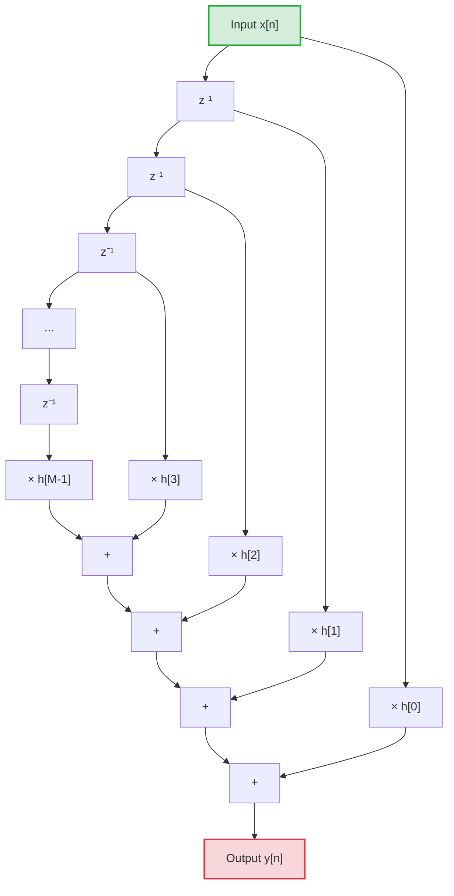

> [!toc]
> - [[#1. State and Prove Parseval's Theorem|1. State and Prove Parseval's Theorem]]
> - [[#2. Obtain Linear Convolution using Circular Convolution|2. Obtain Linear Convolution using Circular Convolution]]
> - [[#3. Complex Multiplications in DFT vs Radix-2 FFT (N=64)|3. Complex Multiplications in DFT vs Radix-2 FFT (N=64)]]
> - [[#4. What is Twiddle Factor?|4. What is Twiddle Factor?]]
> - [[#5. Derive the Mapping between s and z in Bilinear Transformation|5. Derive the Mapping between s and z in Bilinear Transformation]]
> - [[#6. Determine the Order of Butterworth Analog Filter|6. Determine the Order of Butterworth Analog Filter]]
> - [[#7. Draw the Direct Form Realization of FIR System|7. Draw the Direct Form Realization of FIR System]]
> - [[#8. Why Antialiasing Filter is used in Decimating Systems?|8. Why Antialiasing Filter is used in Decimating Systems?]]
> - [[#9. What are the Different Stages in Pipelining?|9. What are the Different Stages in Pipelining?]]
> - [[#10. Compare Von Neumann and Harvard Architecture|10. Compare Von Neumann and Harvard Architecture]]

---

## 1. State and Prove Parseval's Theorem

> [!theorem] State Parseval's Theorem (DFT)
> Parseval's theorem states that the total energy of a signal in the discrete-time domain is equal to the total normalized energy in the frequency (DFT) domain. 
> 
> Mathematically, for an $N$-point sequence $x[n]$ with $N$-point DFT $X[k]$:
> $$\sum_{n=0}^{N-1} |x[n]|^2 = \frac{1}{N} \sum_{k=0}^{N-1} |X[k]|^2$$

### Proof
We can prove this by starting from the left-hand side (LHS) or by using the Inverse Discrete Fourier Transform (IDFT) relation.

The IDFT definition for $x[n]$ is:
$$x[n] = \frac{1}{N} \sum_{k=0}^{N-1} X[k] e^{j\frac{2\pi}{N}kn}$$

Taking the complex conjugate of both sides:
$$x^*[n] = \frac{1}{N} \sum_{k=0}^{N-1} X^*[k] e^{-j\frac{2\pi}{N}kn}$$

Now, write the energy in the time domain:
$$\text{Energy} = \sum_{n=0}^{N-1} |x[n]|^2 = \sum_{n=0}^{N-1} x[n] \cdot x^*[n]$$

Substitute the expression for $x^*[n]$ into the equation:
$$\sum_{n=0}^{N-1} |x[n]|^2 = \sum_{n=0}^{N-1} x[n] \left( \frac{1}{N} \sum_{k=0}^{N-1} X^*[k] e^{-j\frac{2\pi}{N}kn} \right)$$

Interchanging the order of summation:
$$\sum_{n=0}^{N-1} |x[n]|^2 = \frac{1}{N} \sum_{k=0}^{N-1} X^*[k] \left( \sum_{n=0}^{N-1} x[n] e^{-j\frac{2\pi}{N}kn} \right)$$

Recall that the term inside the parenthesis is the definition of the DFT $X[k]$:
$$\sum_{n=0}^{N-1} x[n] e^{-j\frac{2\pi}{N}kn} = X[k]$$

Substituting this back gives:
$$\sum_{n=0}^{N-1} |x[n]|^2 = \frac{1}{N} \sum_{k=0}^{N-1} X^*[k] \cdot X[k]$$

Since $X^*[k] \cdot X[k] = |X[k]|^2$:
$$\sum_{n=0}^{N-1} |x[n]|^2 = \frac{1}{N} \sum_{k=0}^{N-1} |X[k]|^2$$

**Hence Proved.**

---

## 2. Obtain Linear Convolution using Circular Convolution

> [!question] Problem Statement
> Obtain the linear convolution of the sequences $x[n] = \{1, 2, 3\}$ and $h[n] = \{-1, -2\}$ using circular convolution.
> *(Note: The question paper's OCR text $L$ represents $1$.)*

### Steps to Solve
1. **Determine the length of the linear convolution output ($N$):**
   - Length of $x[n]$, $N_1 = 3$
   - Length of $h[n]$, $N_2 = 2$
   - Output length $N = N_1 + N_2 - 1 = 3 + 2 - 1 = 4$

2. **Zero-pad the sequences to length $N = 4$:**
   - $x_p[n] = \{1, 2, 3, 0\}$
   - $h_p[n] = \{-1, -2, 0, 0\}$

3. **Perform 4-point Circular Convolution:**
   Let's use the **Matrix Method** for the calculation:
   $$\mathbf{y} = \mathbf{H} \cdot \mathbf{x}$$
   $$\begin{bmatrix} y[0] \\ y[1] \\ y[2] \\ y[3] \end{bmatrix} = \begin{bmatrix} h_p[0] & h_p[3] & h_p[2] & h_p[1] \\ h_p[1] & h_p[0] & h_p[3] & h_p[2] \\ h_p[2] & h_p[1] & h_p[0] & h_p[3] \\ h_p[3] & h_p[2] & h_p[1] & h_p[0] \end{bmatrix} \begin{bmatrix} x_p[0] \\ x_p[1] \\ x_p[2] \\ x_p[3] \end{bmatrix}$$

   Substitute the values: $x_p = [1, 2, 3, 0]^T$ and $h_p = [-1, -2, 0, 0]^T$:
   $$\begin{bmatrix} y[0] \\ y[1] \\ y[2] \\ y[3] \end{bmatrix} = \begin{bmatrix} -1 & 0 & 0 & -2 \\ -2 & -1 & 0 & 0 \\ 0 & -2 & -1 & 0 \\ 0 & 0 & -2 & -1 \end{bmatrix} \begin{bmatrix} 1 \\ 2 \\ 3 \\ 0 \end{bmatrix}$$

4. **Compute each output sample:**
   - $y[0] = (-1 \times 1) + (0 \times 2) + (0 \times 3) + (-2 \times 0) = -1$
   - $y[1] = (-2 \times 1) + (-1 \times 2) + (0 \times 3) + (0 \times 0) = -2 - 2 = -4$
   - $y[2] = (0 \times 1) + (-2 \times 2) + (-1 \times 3) + (0 \times 0) = -4 - 3 = -7$
   - $y[3] = (0 \times 1) + (0 \times 2) + (-2 \times 3) + (-1 \times 0) = -6$

> [!important] Final Output
> The resulting linear convolution sequence is:
> $$\mathbf{y[n] = \{-1, -4, -7, -6\}}$$

---

## 3. Complex Multiplications in DFT vs Radix-2 FFT (N=64)

> [!question] Problem Statement
> Find the number of complex multiplications involved in the calculation of a 64-point DFT using:
> 1. Direct computation
> 2. Radix-2 FFT algorithm

### 1. Direct DFT Computation
For an $N$-point DFT, each bin calculation requires $N$ complex multiplications. Since there are $N$ bins:
$$\text{Total Complex Multiplications} = N^2$$
For $N = 64$:
$$\text{Complex Multiplications} = 64^2 = \mathbf{4096}$$

### 2. Radix-2 FFT Algorithm
Using the Cooley-Tukey Radix-2 FFT algorithm, the calculation is split into stages. The total number of complex multiplications is:
$$\text{Total Complex Multiplications} = \frac{N}{2} \log_2(N)$$
For $N = 64$:
$$\text{Complex Multiplications} = \frac{64}{2} \log_2(64) = 32 \times 6 = \mathbf{192}$$

> [!info] Summary Comparison
> - **Direct DFT:** $4096$ complex multiplications
> - **Radix-2 FFT:** $192$ complex multiplications
> - **Efficiency Gain:** The Radix-2 FFT reduces the multiplication workload by a factor of $\frac{4096}{192} \approx 21.33$ times.

---

## 4. What is Twiddle Factor?

> [!note] Definition
> The **Twiddle Factor** (also referred to as the phase factor) is a complex trigonometric constant coefficient used in DFT and FFT algorithms. It represents a rotation on the unit circle in the complex plane.
> 
> Mathematically, it is defined as:
> $$W_N = e^{-j\frac{2\pi}{N}} = \cos\left(\frac{2\pi}{N}\right) - j \sin\left(\frac{2\pi}{N}\right)$$
> where $N$ is the DFT size.

### Key Properties of Twiddle Factor

1. **Periodicity:**
   $$W_N^{k+N} = W_N^k$$
   *Proof:*
   $$W_N^{k+N} = e^{-j\frac{2\pi}{N}(k+N)} = e^{-j\frac{2\pi k}{N}} \cdot e^{-j2\pi} = W_N^k \cdot 1 = W_N^k$$

2. **Symmetric Property:**
   $$W_N^{k + N/2} = -W_N^k$$
   *Proof:*
   $$W_N^{k + N/2} = e^{-j\frac{2\pi}{N}(k + N/2)} = e^{-j\frac{2\pi k}{N}} \cdot e^{-j\pi} = W_N^k \cdot (-1) = -W_N^k$$

---

## 5. Derive the Mapping between s and z in Bilinear Transformation

> [!note] Purpose
> The Bilinear Transformation is an algebraic mapping that maps the continuous-time $s$-plane to the discrete-time $z$-plane. It is based on numerical integration using the **Trapezoidal Rule**.

### Derivation

1. Consider a continuous-time integrator system:
   $$H(s) = \frac{Y(s)}{X(s)} = \frac{1}{s} \implies s Y(s) = X(s)$$
   In the time domain, this is represented by the differential equation:
   $$\frac{dy(t)}{dt} = x(t)$$

2. Integrate both sides over a single sample period from $(n-1)T$ to $nT$:
   $$\int_{(n-1)T}^{nT} \frac{dy(t)}{dt} dt = \int_{(n-1)T}^{nT} x(t) dt$$
   $$y(nT) - y((n-1)T) = \int_{(n-1)T}^{nT} x(t) dt$$

3. Approximate the area under $x(t)$ using the **Trapezoidal Rule**:
   $$\int_{(n-1)T}^{nT} x(t) dt \approx \frac{T}{2} [x(nT) + x((n-1)T)]$$
   Substituting this approximation:
   $$y(nT) - y((n-1)T) \approx \frac{T}{2} [x(nT) + x((n-1)T)]$$

4. Express the equation in discrete notation ($y(nT) \to y[n]$, $x(nT) \to x[n]$):
   $$y[n] - y[n-1] = \frac{T}{2} (x[n] + x[n-1])$$

5. Apply the $z$-transform on both sides:
   $$Y(z) - z^{-1} Y(z) = \frac{T}{2} (X(z) + z^{-1} X(z))$$
   $$Y(z) (1 - z^{-1}) = \frac{T}{2} X(z) (1 + z^{-1})$$
   $$H(z) = \frac{Y(z)}{X(z)} = \frac{T}{2} \left( \frac{1 + z^{-1}}{1 - z^{-1}} \right)$$

6. Equating $H(s) = \frac{1}{s}$ and $H(z)$:
   $$\frac{1}{s} = \frac{T}{2} \left( \frac{1 + z^{-1}}{1 - z^{-1}} \right)$$
   $$s = \frac{2}{T} \left( \frac{1 - z^{-1}}{1 + z^{-1}} \right) = \frac{2}{T} \left( \frac{z - 1}{z + 1} \right)$$

7. **Frequency Mapping (Warping relation):**
   Substitute $s = j\Omega$ and $z = e^{j\omega}$:
   $$j\Omega = \frac{2}{T} \left( \frac{e^{j\omega} - 1}{e^{j\omega} + 1} \right) = \frac{2}{T} \left( \frac{e^{j\omega/2} (e^{j\omega/2} - e^{-j\omega/2})}{e^{j\omega/2} (e^{j\omega/2} + e^{-j\omega/2})} \right) = \frac{2}{T} \left( \frac{2j\sin(\omega/2)}{2\cos(\omega/2)} \right)$$
   $$\mathbf{\Omega = \frac{2}{T} \tan\left(\frac{\omega}{2}\right)}$$

---

## 6. Determine the Order of Butterworth Analog Filter

> [!question] Problem Statement
> Given the specifications:
> - Passband attenuation: $A_p = 1\text{ dB}$
> - Stopband attenuation: $A_s = 30\text{ dB}$
> - Passband edge frequency: $\Omega_p = 200\text{ rad/sec}$
> - Stopband edge frequency: $\Omega_s = 600\text{ rad/sec}$
> 
> Determine the order ($N$) of the Butterworth analog filter.

### Calculation Steps

1. **Write down the order formula:**
   $$N \ge \frac{\log_{10} \left( \frac{10^{0.1 A_s} - 1}{10^{0.1 A_p} - 1} \right)}{2 \log_{10}\left( \frac{\Omega_s}{\Omega_p} \right)}$$

2. **Compute the numerator term:**
   - $10^{0.1 A_s} - 1 = 10^{3} - 1 = 999$
   - $10^{0.1 A_p} - 1 = 10^{0.1} - 1 \approx 1.258925 - 1 = 0.258925$
   - Ratio: $\frac{999}{0.258925} \approx 3858.26$
   - $\log_{10}(3858.26) \approx 3.58639$

3. **Compute the denominator term:**
   - $\frac{\Omega_s}{\Omega_p} = \frac{600}{200} = 3$
   - $\log_{10}(3) \approx 0.47712$
   - $2 \log_{10}(3) \approx 0.95424$

4. **Compute $N$:**
   $$N \ge \frac{3.58639}{0.95424} \approx 3.758$$

5. **Choose the smallest integer greater than or equal to the computed value:**
   $$\mathbf{N = 4}$$

> [!important] Result
   The order of the Butterworth Analog Filter must be **$N = 4$**.

---

## 7. Draw the Direct Form Realization of FIR System

> [!note] Background
> An FIR filter of length $M$ is defined by:
> $$y[n] = \sum_{k=0}^{M-1} h[k] x[n-k] = h[0]x[n] + h[1]x[n-1] + \dots + h[M-1]x[n-(M-1)]$$
> Direct Form realization implements this equation directly as a tapped delay line.

### Signal Flow Graph

---

## 8. Why Antialiasing Filter is used in Decimating Systems?

> [!note] Reason
> In decimation, the sampling rate is reduced by a factor $D$ ($F_s \to F_s/D$). This shrinks the allowable bandwidth (the Nyquist limit) from $F_s/2$ to $F_s/(2D)$.
> 
> Without an antialiasing filter, any frequency components in the original signal that lie above the new Nyquist limit ($> F_s/(2D)$) will **alias** (fold back) into the band of interest, irreversibly corrupting the downsampled signal.

### Role of the Antialiasing Filter
- A lowpass filter (called the decimator filter) is placed **before** the downsampler.
- It attenuates all frequencies above $\frac{F_s}{2D}$.
- This ensures that when downsampling occurs, no high-frequency noise or signals can wrap into the low-frequency baseband.

---

## 9. What are the Different Stages in Pipelining?

> [!note] Concept
> Pipelining is a hardware instruction-execution technique that overlaps execution phases of multiple instructions to maximize processor throughput (operations per second).

Standard instruction execution in DSP / microprocessors is divided into **4 to 5 key stages**:

1. **Instruction Fetch (IF):** 
   The instruction is fetched from program memory using the address in the Program Counter (PC).
2. **Instruction Decode (ID):** 
   The instruction is decoded by control logic to determine the operation type, source registers, and routing.
3. **Operand Fetch (OF) / Read:** 
   The required data operands are read from the data memory or register files.
4. **Execute (EX):** 
   The actual arithmetic or logical operation (like multiplication or MAC) is performed by the ALU / MAC hardware.
5. **Write Back (WB):** 
   The execution result is written back to the destination register or memory location.

By executing these stages in parallel across different instructions, a new instruction can complete every clock cycle once the pipeline is full.

---

## 10. Compare Von Neumann and Harvard Architecture

| Feature | Von Neumann Architecture | Harvard Architecture |
| :--- | :--- | :--- |
| **Memory Spaces** | Single memory space shared by both program instructions and data. | Two distinct, separate memory spaces for program instructions and data. |
| **Buses** | A single set of address and data buses is shared. | Separate address/data buses for instruction memory and data memory. |
| **Bottleneck** | **Von Neumann Bottleneck:** Instruction fetch and data access cannot occur simultaneously, limiting speed. | **No Bottleneck:** Can fetch an instruction and access data memory in the same clock cycle. |
| **Complexity** | Simpler hardware design and fewer processor pins. | More complex hardware design and higher pin count. |
| **Memory Efficiency** | Higher efficiency; unused program memory space can be occupied by data. | Rigid; unused program memory space cannot be dynamically used for data. |
| **Main Application** | General-purpose microprocessors (e.g., standard PC CPUs, Intel, AMD). | Digital Signal Processors (DSPs) (e.g., TI TMS320 series) and microcontrollers (e.g., AVR, PIC, ARM Cortex-M). |
