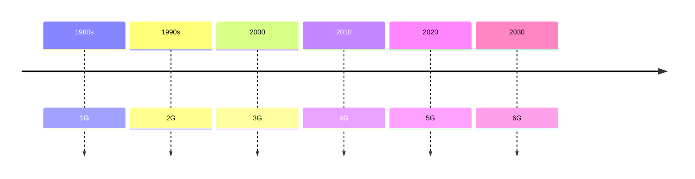
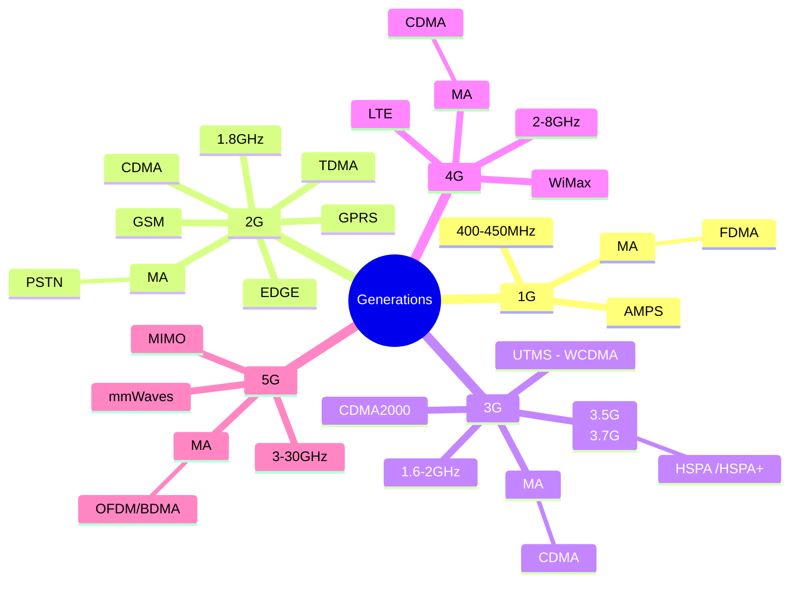

# Generations

Marconi transmitted **Morse code** signals using radio waves wirelessly to a distance of **3.2 KMs** in #1895





- [[1G]]
- [[2G]]
- [[3G]]
- [[4G]]
- [[5G]]
- [[6G]]

```dataview
TABLE  
Invented , max_speed as "Maximum Speed" , Latency, Frequency as "Band" , Tech , Multiple_Access, BandWidth, Issue
from #generations 
SORT file.name ASC
```
