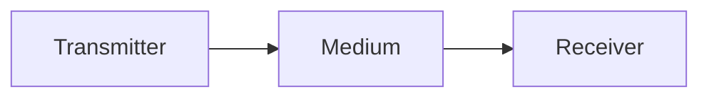
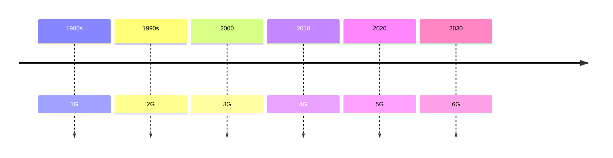
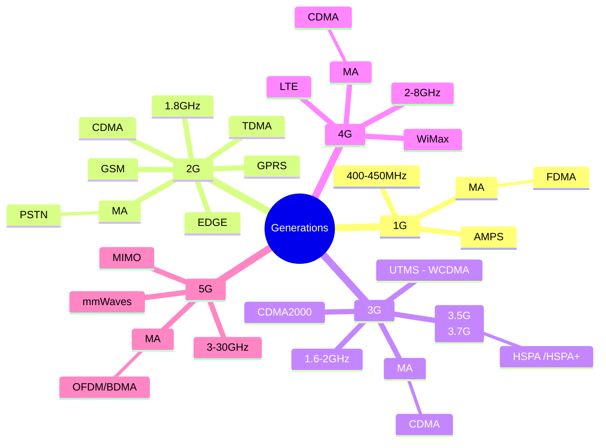
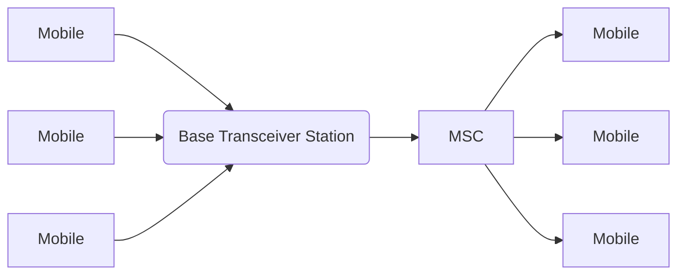

# Module 1
- [[Cellular System Design Fundamentals]]
## Module 1 Syllabus

- **Introduction to Wireless Communication Systems**

- [X] Generations: 2G, 3G, 4G, 5G. ✅ 2026-03-19
- [ ] Wireless LAN,
- [X] Bluetooth and Personal Area networks, ✅ 2026-03-19
- [X] Broadband Wireless Access -- WiMAX Technology. ✅ 2026-03-19
- [ ] Wireless Spectrum allocation, Standards.

- **Cellular System Design Fundamentals**

- [ ] Frequency Reuse,
- [ ] channel assignment strategies
- [ ] Handoff strategies,
- [ ] Interferenchannel assignment strategies
- [ ] Handoff strategies,
- [ ] Interference and system capacity,
- [ ] trunking and grade off service,
- [ ] improving coverage and capacity – cell splitting,
- [ ] sectoring, microcells.ce and system capacity,
- [ ] trunking and grade off service,
- [ ] improving coverage and capacity – cell splitting,
- [ ] sectoring, microcells.

- Need for Multi carrier system
- Basics of Orthogonal Frequency Division Multiplexing (OFDM), Multiple access for OFDM 
- Orthogonal Frequency Division Multiple Access (OFDMA)
- Cellular concept, path loss and shadowing, doppler shift,
- Multipath effect
- Significance of diversity in wireless communication systems

### Need for Multi Carrier Systems 
The traditional Single carrier systems use only **single frequency to carry all data**. Multicarrier systems use **multicarrier modulation (MCM)** schemes by which the transmitted data stream is divided into **several parallel lower–bit rate subcarriers**^[https://www.sciencedirect.com/topics/engineering/multicarrier-system].

[[MultiCarrier Modulation]]

## Introduction

- At their core, these systems use electromagnetic waves—radio, microwave, sometimes even infrared or millimeter waves—to carry signals across space without needing a physical connection.



- A transmitter takes your information (`voice`, `text`, `video`), converts it into an electrical signal, **and modulates it onto a carrier wave** (a high-frequency signal suitable for transmission).
- That carrier rides through the wireless medium—air, vacuum, sometimes even water.
- A receiver picks it up, demodulates it, and extracts the *original information*.

### Carrier

$$
y = A \sin(2\pi f t)
$$

Where:

* $A$ = amplitude
* $f$ = frequency
* $t$ = time

---

## Generations

Marconi transmitted **Morse code** signals using radio waves wirelessly to a distance of **3.2 KMs** in #1895





- [[1G]]
- [[2G]]
- [[3G]]
- [[4G]]
- [[5G]]
- [[6G]]

```dataview
TABLE  
Invented , max_speed as "Maximum Speed" , Latency, Frequency as "Band" , Tech , Multiple_Access, BandWidth, Issue
from #generations 
SORT file.name ASC
```


## WLAN

- within an area of building/school etc
- 2.4GHz Band
- the `phy` and `MAC` layer is specified by the IEEE802.11 standard

| Wi-Fi Standards | Max Speed | Frequency   | Year Introduced |
| --------------- | --------- | ----------- | --------------- |
| 802.11          | 2 Mbps    | 2.4 GHz     | 1997            |
| 802.11a         | 54 Mbps   | 5 GHz       | 1999            |
| 802.11b         | 11 Mbps   | 2.4 GHz     | 1999            |
| 802.11g         | 54 Mbps   | 2.4 GHz     | 2003            |
| 802.11n         | 600 Mbps  | 2.4/5 GHz   | 2009            |
| 802.11ac        | 3.5 Gbps  | 5 GHz       | 2014            |
| 802.11ax        | 9.6 Gbps  | 2.4/5/6 GHz | 2019            |
| 802.11be        | 46 Gbps   | 2.4/5/6 GHz | Est. 2024       |

### Advantages

- **Mobility:** You can move around freely without losing your connection.
- **Scalability:** Adding a new device to the network is as simple as typing in a password, rather than running a new physical cable through the walls.
- **Device Support:** Many modern devices (especially mobile phones and small electronics) don't even have ports for wired connections anymore

## Bluetooth

- It also uses the 2.4GHz
- low data rate compared to wifi
- also short distance
- uses radio waves

## PAN

*refers to a network of devices connected within a small geographical area*
**eg**: [[#Bluetooth]]

## WiMAX[^1]

- Based on IEEE 802.16
- 

## Wireless Spectrum allocation, Standards.


## **Cellular System Design Fundamentals**

- It replaces the single big transmitter (high  power) transmitter with many low power transmitter(cells)
- Making Call



- MSC -> mobile switching center , mobile telecommunication switching center
- Base Transceiver

### Frequency Reuse (Frequency Planning)

***The design process of selecting and allocating channel groups for all of the cellular base stations within a system is called frequency reuse or frequency planning. It involves dividing a geographical area into smaller regions, called  cells, and assigning the same set of frequencies to different cells that are spaced sufficiently apart***

Radio spectrum is a scarce, expensive resource. A network provider might only own the rights to, say, 100 frequency channels. If a whole city used one giant antenna, only 100 people could talk at once.
**Frequency Reuse** solves this. The provider divides those 100 channels among a cluster of cells (e.g., 7 cells). Once you move far enough away from a specific cell, the signal becomes weak enough that you can **reuse those exact same frequencies** in another cell without them interfering with each other. The minimum distance required to reuse a frequency safely is called the  **Reuse Distance (** $D$**)**


### Hand-Off

Q. What are the methods adopted for hand-off procedures

![[Pasted image 20250419190411.png]]
A hard handoff occurs when the old connection is broken before a new connection is activated

A hard handoff is essentially a “break before make” connection.

## Fading

Q.  how does fading occur , derive the expression for doplar shift
 Fading refers to the variation in signal strength over time or space due to various interference effects

## Multiple Access

*It is the application of multiplexing*

1. [[FDMA]]

![[Screenshot_2025_0921_183750.png]]

[^1]: WiMAX (Worldwide Interoperability for Microwave Access) is a broadband wireless communication technology that provides high-speed internet access over long distances.

---
**1. Channel Assignment Strategies**

The primary goal of channel assignment strategies is to optimize frequency reuse and minimize interference to increase overall channel capacity. They dictate how calls are managed when a user moves between cells:

- **Fixed Channel Allocation (FCA):** Each cell is assigned a specific, predetermined set of voice channels. If all channels in a cell are busy, new calls are blocked. FCA may use a "borrowing approach" where a cell can borrow channels from a neighboring cell (supervised by the Mobile Switching Centre, or MSC) as long as it doesn't cause interference. FCA is highly efficient under uniform traffic but wastes resources when traffic is non-uniform.
- **Dynamic Channel Allocation (DCA):** Channels are pooled rather than permanently assigned to specific cells. When a cell needs a channel, it requests one from the MSC, which assigns it based on real-time data like traffic distribution, likelihood of future blocking, and the required frequency reuse distance to avoid interference. DCA increases channel utilization and decreases blocked calls but requires a heavy computational load on the MSC.
- **Hybrid Channel Allocation:** This is a mix of both fixed and dynamic allocation methods.

**2. Handoff Strategies**

**Handoff** is the process of transferring an active call from one base station (BS) to another as the mobile unit moves, without disconnecting the call.

- **The Handoff Process:** When a mobile's signal at the current BS weakens while simultaneously improving at a neighboring BS, the MSC initiates a handoff. To do this properly, designers set a threshold margin: Δ=Pr_handoff​−Pr_minimum_usable​. If Δ is too large, the MSC gets burdened with unnecessary handoffs. If Δ is too small, there isn't enough time to complete the handoff, and the call drops due to weak signals.
- **Types of Handoff:**
    - **Hard Handoff:** A "break-before-make" scenario where the connection to the old BS is broken before connecting to the new one (common when changing frequencies or moving between disjointed systems).
    - **Soft Handoff (SHO):** A "make-before-break" scenario where the mobile connects to more than one BS simultaneously until the transition is fully complete.
- **Deciding Factors:** Handoff decisions rely on the transmitted signal strength, vehicle speed (steep signal drops require faster handoffs), and the dwell time (how long a call is maintained within a single cell).

**3. Interference and System Capacity**

**Interference** is a major bottleneck in cellular systems, causing cross-talk on voice channels and missed or dropped calls on control channels. It is generally harder to control than capacity issues.

- **System Capacity:** Overall capacity is capped by three bottlenecks: radio capacity, control link capacity, or switch capacity. Improving radio capacity alone is useless if the switch capacity isn't large enough to handle the traffic.
- **Co-Channel Interference:** Occurs between cells using the exact same frequency channels. It cannot be fixed by increasing transmitter power (which would just cause more interference). Instead, it is minimized by physically separating co-channel cells by a "frequency reuse distance" (D). The ratio q=D/R (where R is the cell radius) relates directly to the cluster size N (q=3N​).
- **Adjacent Channel Interference:** Occurs when frequencies of adjacent channels leak into the desired channel, often causing the "near-far problem" where a nearby transmitter captures the receiver. It is mitigated by careful filtering, maximizing frequency separation between adjacent cells, and using constant power control to ensure mobiles transmit at the lowest possible power.

**4. Trunking and Grade of Service**

- **Trunking:** This concept allows a large number of users to share a much smaller number of mobile channels by assigning channels strictly on a demand basis. When a call terminates, the channel is immediately returned to the available pool for the next user. Traffic intensity in this system is measured in **Erlangs**.
- **Grade of Service (GOS):** GOS is the benchmark of a trunked system's performance, representing the probability that a call will be blocked or delayed beyond an acceptable time limit during the busiest hour of the day (statistically around 4 PM to 6 PM). For instance, a system designed for a 2% GOS implies that 2 out of every 100 calls attempted during the busiest hour will be blocked.

**5. Improving Coverage and Capacity**

When demand exhausts the available channels in a cell, techniques are deployed to serve more channels per unit of coverage area:

- **Cell Splitting:** A congested cell is subdivided into smaller cells (microcells), each getting its own new base station. To maintain the frequency reuse plan and limit interference, the antenna heights and transmitter powers must be drastically reduced. For example, halving the radius of a cell requires dropping the transmit power by 12 dB.
- **Cell Sectoring:** Instead of building new base stations, an existing cell is split into angular sectors (like 120° or 60° slices). An omnidirectional antenna is replaced by several directional antennas, which radiate only within their sector. Because the antennas only broadcast in specific directions, co-channel interference is vastly reduced, allowing the Signal-to-Interference Ratio (SIR) to increase.
- **Microcell Zone Concept:** Similar to sectoring, but better. Multiple zone sites (Tx/Rx antennas) are placed at the edges of a cell and connected back to a single, central base station using coaxial cables or microwave links. As a mobile travels through the cell, it is automatically served by the zone with the strongest signal using the same channel equipment at the base station. This eliminates the need for handoffs between zones and actively reduces interference since the channel is only transmitting in the exact zone the mobile currently occupies
