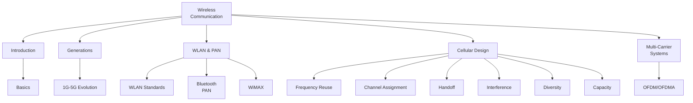
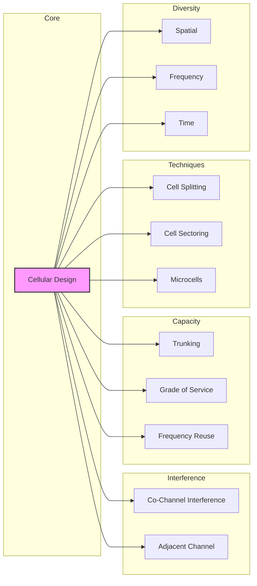

# Module 1 - Wireless Communication (ECT402)

> Comprehensive notes for ECT402 Wireless Communication - 8th Semester BTech

---

## 📚 Module Overview

---

## 📋 Syllabus Topics

### Part 1: Introduction to Wireless Communication Systems

| Topic | Status | Notes |
|-------|--------|-------|
| Introduction to Wireless Communication | ✅ Complete | [[Introduction]] |
| **Wireless Generations** | ✅ Complete | [[Generations]] - 1G, 2G, 3G, 4G, 5G |
| **Wireless LAN (WLAN)** | ✅ Complete | [[WLAN]] - IEEE 802.11 standards |
| Bluetooth and Personal Area Networks | ✅ Complete | [[Bluetooth, PAN, WiMax]] |
| Broadband Wireless Access - WiMAX | ✅ Complete | [[Bluetooth, PAN, WiMax]] |
| **Wireless Spectrum Allocation, Standards** | ✅ Complete | [[Wireless Spectrum Allocation]] ← NEW |

### Part 2: Cellular System Design Fundamentals

| Topic | Status | Notes |
|-------|--------|-------|
| **Cellular Concept** | ✅ Complete | [[Cellular System Design Fundamentals]] |
| **Frequency Reuse** | ✅ Complete | [[Cellular System Design Fundamentals#Frequency Reuse]] |
| **Channel Assignment Strategies** | ✅ Complete | [[Cellular System Design Fundamentals#Channel Assignment Strategies]] |
| **Handoff Strategies** | ✅ Complete | [[Cellular System Design Fundamentals#Handoff Strategies]] |
| **Interference and System Capacity** | ✅ Complete | [[Interference and System Capacity]] |
| **Trunking and Grade of Service** | ✅ Complete | [[Interference and System Capacity#Trunking]] |
| **Improving Coverage and Capacity** | ✅ Complete | [[Cellular System Design Fundamentals#Improving Coverage and Capacity]] |
| **Cell Splitting, Sectoring, Microcells** | ✅ Complete | [[Cellular System Design Fundamentals#Improving Coverage and Capacity]] |
| **Significance of Diversity** | ✅ Complete | [[Significance of Diversity in Wireless Communication]] ← NEW |

### Part 3: Multi-Carrier Systems & Propagation

| Topic | Status | Notes |
|-------|--------|-------|
| **Need for Multi-Carrier Systems** | ✅ Complete | [[Need for Multi Carrier Systems]] |
| **OFDM Basics** | ✅ Complete | [[MultiCarrier Modulation]] |
| **OFDMA** | ✅ Complete | [[MultiCarrier Modulation]] |
| **Path Loss and Shadowing** | ✅ Complete | [[Path Loss, Shadowing & Doppler Shift]] ← NEW |
| **Doppler Shift** | ✅ Complete | [[Path Loss, Shadowing & Doppler Shift]] ← NEW |
| **Multipath Effect** | ✅ Complete | [[Multipath Effect & Doppler Shift]] ← NEW |

---

## 📖 Detailed Topic Links

### 1. Introduction & Basics
- [[Introduction]] - Fundamentals of wireless communication
- [[Wireless Spectrum Allocation]] - Spectrum bands & regulations

### 2. Generations (1G - 5G)
- [[1G]] - First Generation (Analog)
- [[2G]] - Second Generation (Digital)
- [[3G]] - Third Generation
- [[3.5G]] - 3.5 Generation
- [[3.75G]] - 3.75 Generation
- [[4G]] - Fourth Generation (LTE)
- [[5G]] - Fifth Generation
- [[6G]] - Sixth Generation (Future)

### 3. WLAN, PAN & WiMAX
- [[WLAN]] - Wireless LAN standards (802.11a/b/g/n/ac/ax)
- [[Bluetooth, PAN, WiMax]] - Bluetooth & WiMAX technology

### 4. Cellular System Design
- [[Cellular System Design Fundamentals]] - Complete cellular concepts
- [[Interference and System Capacity]] - Interference types, trunking, GoS
- [[Significance of Diversity in Wireless Communication]] - MIMO, diversity combining

### 5. Propagation Effects
- [[Path Loss, Shadowing & Doppler Shift]] - Large-scale fading
- [[Multipath Effect & Doppler Shift]] - Small-scale fading, Rayleigh fading

### 6. Multi-Carrier Systems
- [[Need for Multi Carrier Systems]] - Why OFDM is needed
- [[MultiCarrier Modulation]] - OFDM, OFDMA principles

---

## 📝 Important Topics Reference

See [[Important Topics]] for key exam-focused topics.

---

## 🔗 Cross-Reference Diagram

---

## 📊 Quick Reference Summary

| Topic | Key Formula/Concept | Location |
|-------|-------------------|----------|
| Frequency Reuse | Q = D/R = √3N | [[Cellular System Design Fundamentals]] |
| Co-channel Interference | S/I ratio, spatial separation | [[Interference and System Capacity]] |
| Trunking | Erlangs | [[Interference and System Capacity]] |
| Grade of Service | GoS = P(blocked) | [[Interference and System Capacity]] |
| Path Loss | 20log₁₀(d) + 20log₁₀(f) | [[Path Loss, Shadowing & Doppler Shift]] |
| Doppler Shift | f_d = vf_c/c | [[Multipath Effect & Doppler Shift]] |
| OFDM | N subcarriers, orthogonality | [[MultiCarrier Modulation]] |

---

## 📅 Study Progress

- [x] Generations: 2G, 3G, 4G, 5G ✅
- [x] Wireless LAN ✅
- [x] Bluetooth and Personal Area networks ✅
- [x] Broadband Wireless Access -- WiMAX Technology ✅
- [x] Wireless Spectrum allocation, Standards ✅
- [x] Frequency Reuse ✅
- [x] Channel assignment strategies ✅
- [x] Handoff strategies ✅
- [x] Interference and system capacity ✅
- [x] Trunking and grade of service ✅
- [x] Improving coverage and capacity ✅
- [x] Cell splitting, sectoring, microcells ✅
- [x] Need for Multi carrier system ✅
- [x] OFDM, OFDMA ✅
- [x] Cellular concept, path loss and shadowing ✅
- [x] Doppler shift ✅
- [x] Multipath effect ✅
- [x] Significance of diversity ✅

