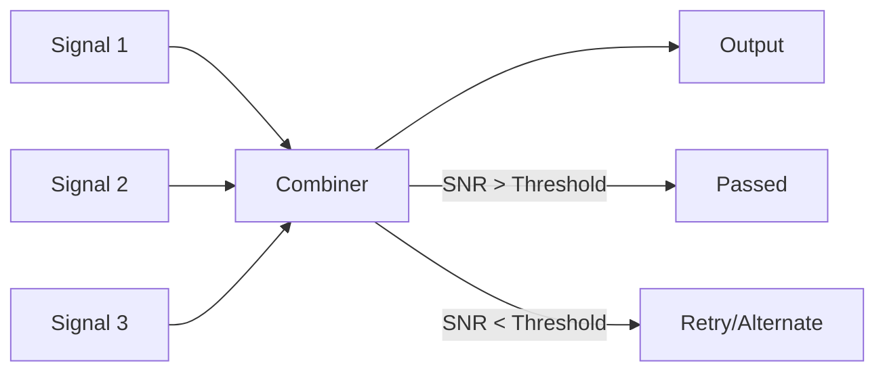

---
tags:
  - wireless_communication
  - diversity
  - fading
---

# Significance of Diversity in Wireless Communication

> **Diversity** is a technique used to combat [[#Multipath Fading]] by providing multiple independent versions of the same signal through different propagation paths or channels.

## Why Diversity is Important

In wireless channels, signals undergo:

- [[Multipath Effect]] - Multiple delayed copies arrive at receiver
- **Fading** - Signal strength varies randomly over time/space
- **Interference** - Signals combine constructively/destructively

Without diversity, these effects cause:
- ❌ High bit error rate (BER)
- ❌ Unreliable communication
- ❌ Call drops in mobile networks

## Types of Diversity

### 1. **Spatial Diversity (Antenna Diversity)**

> Multiple antennas at different physical positions receive different signal versions

```
Transmitter (Tx)
     │
     ├────► Antenna 1 ──► Path 1 ──► Receiver
     │
     ├────► Antenna 2 ──► Path 2 ──► Receiver (diversity combining)
     │
     └────► Antenna 3 ──► Path 3 ──► Receiver
```

- **MIMO** (Multiple Input Multiple Output): Multiple Tx and Rx antennas
- **SIMO** (Single Input Multiple Output): One Tx, multiple Rx
- **MISO** (Multiple Input Single Output): Multiple Tx, one Rx

### 2. **Frequency Diversity**

> Same information transmitted on multiple frequency channels

- **Frequency Hopping Spread Spectrum (FHSS)**
- **OFDM sub-carriers** - Each sub-carrier experiences different fading
- **Wideband signals** - Spread across spectrum experience frequency-selective fading

### 3. **Time Diversity**

> Same information transmitted at different time instants

- **Interleaving** - Spreading error-prone bits across time
- **Forward Error Correction (FEC)** with interleaving
- **Automatic Repeat Request (ARQ)** - Retransmission after errors

### 4. **Polarization Diversity**

> Using different antenna polarizations (vertical/horizontal, +/- 45°)

### 5. **Angular (Directional) Diversity**

> Using directional antennas pointing in different directions

## Diversity Combining Techniques

When multiple signal versions are received:



### Selection Combining
Select the signal with highest SNR

### Switched Combining
Switch to alternate signal when SNR drops below threshold

### Maximal Ratio Combining (MRC)
Weight each signal by its SNR and combine optimally:
$$r_{MRC} = \frac{\sum_i a_i r_i}{\sum_i a_i^2}$$
where $a_i$ is the weight proportional to signal amplitude

### Equal Gain Combining
Equal weights ($a_i = 1$) - simpler but slightly less optimal than MRC

## Diversity in Modern Systems

| Technology | Diversity Method |
|------------|-------------------|
| **4G LTE** | MIMO, Frequency-selective scheduling |
| **5G NR** | Massive MIMO, Beamforming |
| **Wi-Fi 802.11n/ac/ax** | MIMO (up to 8x8) |
| **Bluetooth** | Frequency hopping |
| **GPS** | Multiple satellite signals |

## Benefits Summary

| Without Diversity | With Diversity |
|-------------------|----------------|
| High BER (~10⁻²) | Low BER (~10⁻⁵) |
| Frequent drops | Reliable connection |
| Limited coverage | Extended coverage |
| Poor spectral efficiency | Better throughput |

---

**Related Topics:**
- [[Cellular System Design Fundamentals]]
- [[Interference and System Capacity]]
- [[Multipath Effect & Doppler Shift]]