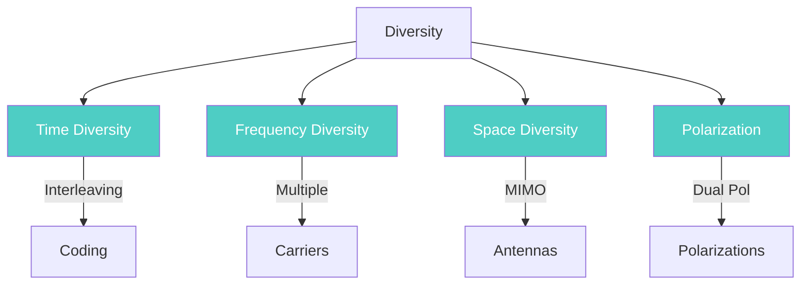

# Diversity

**Diversity** = Transmitting the same info over multiple independent channels to combat fading.

---

## How It Reduces Fading

### 1. Path Independence
- Wireless signals travel through multiple paths due to reflection, scattering, diffraction
- Each path experiences independent fading
- When one path is in a deep fade (weak signal), another path may have strong signal

### 2. Statistical Averaging
- By combining multiple independent paths, the overall signal is averaged
- Probability that ALL paths are in fade simultaneously is very low
- Reduces **outage probability** (chance of signal dropping below threshold)

### 3. Diversity Gain
- The SNR gain obtained is called "diversity gain"
- Does not require increasing transmit power
- Error probability decreases as: P_e ∝ (SNR)^(-G_d)
- G_d = diversity order (number of independent branches)

### Example:

| Without Diversity | With Diversity (3 branches) |
|------------------|---------------------------|
| If 1 path fades → signal lost | If 1 path fades → 2 other paths still work |
| High outage probability | Low outage probability |

---

## Types of Diversity

| Type | Description |
|------|-------------|
| Time Diversity | Interleaving + coding across time slots |
| Frequency Diversity | Multiple carriers, spread spectrum |
| Space Diversity | Multiple antennas (MIMO) |
| Polarization Diversity | Different antenna polarizations |

---

## Combining Techniques

### Selection Combining (SC)

- Selects **highest instantaneous SNR** branch
- Uses only one branch for detection
- **Simple, low cost**, but suboptimal

### Maximal Ratio Combining (MRC)

- Weights each branch by channel gain
- **Combines all branches** constructively
- **Optimal performance** but higher complexity

| Feature | SC | MRC |
|---------|-----|------|
| SNR Improvement | Moderate | Maximum |
| Complexity | Lowest | Highest |
| RF Chains | 1 (switched) | All active |
| Diversity Order | N (suboptimal) | N (optimal) |

---

## Related Notes

- [[Module 2/Fading]] - Fading types
- [[Module 2/Multipath Propagation]] - Multipath cause
- [[Module 2/Path Loss]] - Path loss & shadowing
- [[Module 2/Doppler Shift]] - Doppler shift
- [[Module 2/Shannon Capacity]] - Capacity theorem
- [[Module 2/Module 2 PYQ]] - PYQs