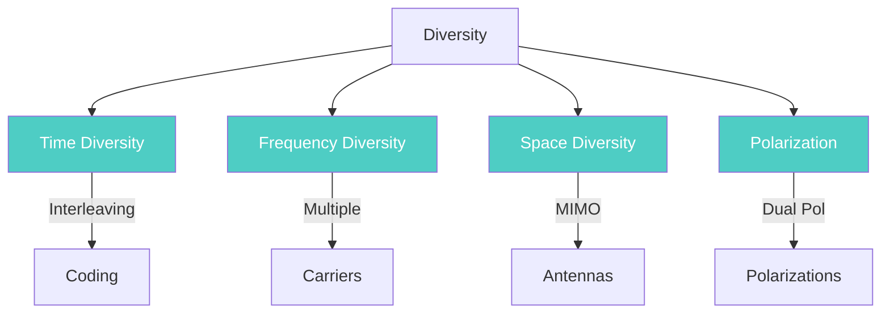

# Diversity

**Diversity** = Transmitting the same info over multiple independent channels to combat fading.

---

## How It Reduces Fading

- If one path is in fade, another may have good signal
- Statistical averaging reduces outage probability
- Provides **diversity gain** without increasing power

---

## Types of Diversity

| Type | Description |
|------|-------------|
| Time Diversity | Interleaving + coding across time slots |
| Frequency Diversity | Multiple carriers, spread spectrum |
| Space Diversity | Multiple antennas (MIMO) |
| Polarization Diversity | Different antenna polarizations |

---

## Combining Techniques

### Selection Combining (SC)

- Selects **highest instantaneous SNR** branch
- Uses only one branch for detection
- **Simple, low cost**, but suboptimal

### Maximal Ratio Combining (MRC)

- Weights each branch by channel gain
- **Combines all branches** constructively
- **Optimal performance** but higher complexity

| Feature | SC | MRC |
|---------|-----|------|
| SNR Improvement | Moderate | Maximum |
| Complexity | Lowest | Highest |
| RF Chains | 1 (switched) | All active |
| Diversity Order | N (suboptimal) | N (optimal) |

---

## Related Notes

- [[Module 2/Fading]] - Fading types
- [[Module 2/Multipath Propagation]] - Multipath cause
- [[Module 2/Path Loss]] - Path loss & shadowing
- [[Module 2/Doppler Shift]] - Doppler shift
- [[Module 2/Shannon Capacity]] - Capacity theorem
- [[Module 2/Module 2 PYQ]] - PYQs