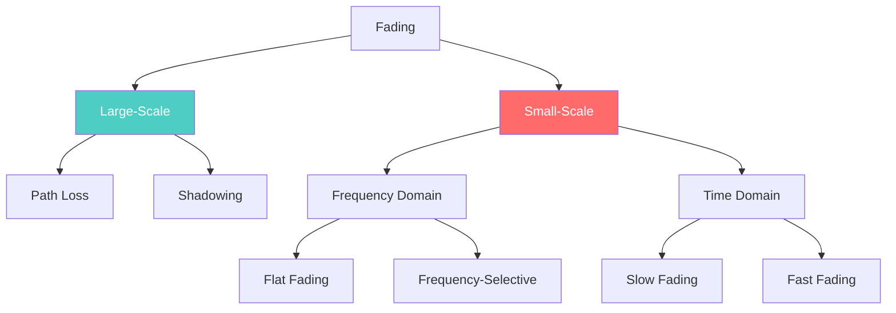

# Fading

**Fading** = Random variation in signal amplitude, phase, or angle of arrival as it propagates through a wireless channel.

---

## Types of Fading

| Type | Cause | Scale |
|------|-------|-------|
| **Path Loss** | Signal spreads with distance | Large |
| **Shadowing** | Blocked by obstacles | Large |
| **Flat Fading** | Bs < Bc | Small |
| **Frequency-Selective** | Bs > Bc | Small |
| **Slow Fading** | Ts < Tc | Small |
| **Fast Fading** | Ts > Tc | Small |

---

## Classification Matrix

| | Flat Fading | Frequency-Selective |
|---|-------------|---------------------|
| **Slow** | Slow + Flat | Slow + Freq-Selective |
| **Fast** | Fast + Flat | Fast + Freq-Selective |

**Best Case**: Slow + Flat | **Worst Case**: Fast + Frequency-Selective

---

## Key Parameters

| Parameter | Measures | Formula |
|-----------|----------|---------|
| Coherence Bandwidth (Bc) | Frequency selectivity | Bc ≈ 1/5τ_rms |
| Coherence Time (Tc) | Time selectivity | Tc ≈ 0.423/f_m |

---

## Statistical Models

| Distribution | Condition |
|--------------|------------|
| Rayleigh | No LOS (NLOS) |
| Rician | With LOS |
| Nakagami-m | General case |

---

## Related Notes

- [[Fading Theory]] - Detailed theory
- [[Multipath Propagation]] - Cause of fading
- [[Diversity]] - Diversity techniques
- [[Path Loss]] - Large-scale fading
- [[Shannon Capacity]] - Capacity theorem
- [[Multipath Propagation]] - Cause of fading
- [[Doppler Shift]] - Time variation cause
- [[Statistical Multipath Channel Models]] - Channel models
- [[Coherence]] - Coherence bandwidth & time
- [[Module 2 PYQ]] - PYQs on fading