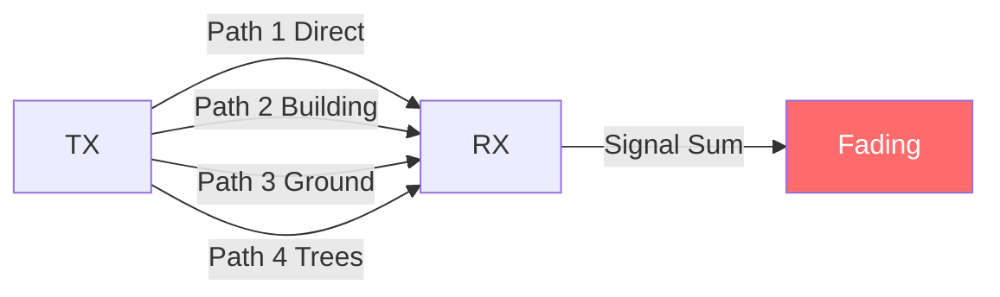
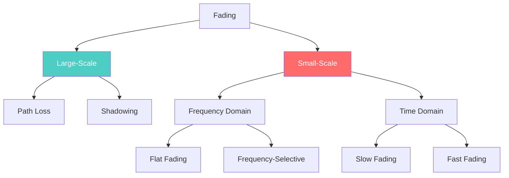
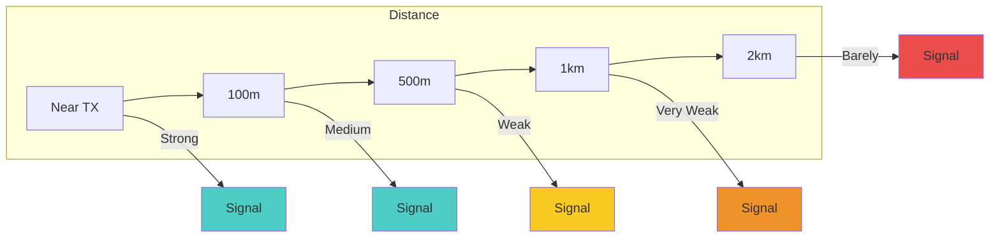
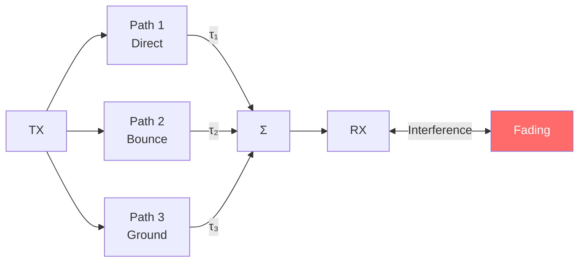
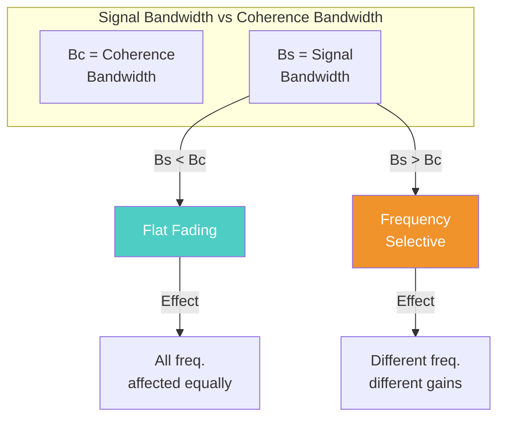
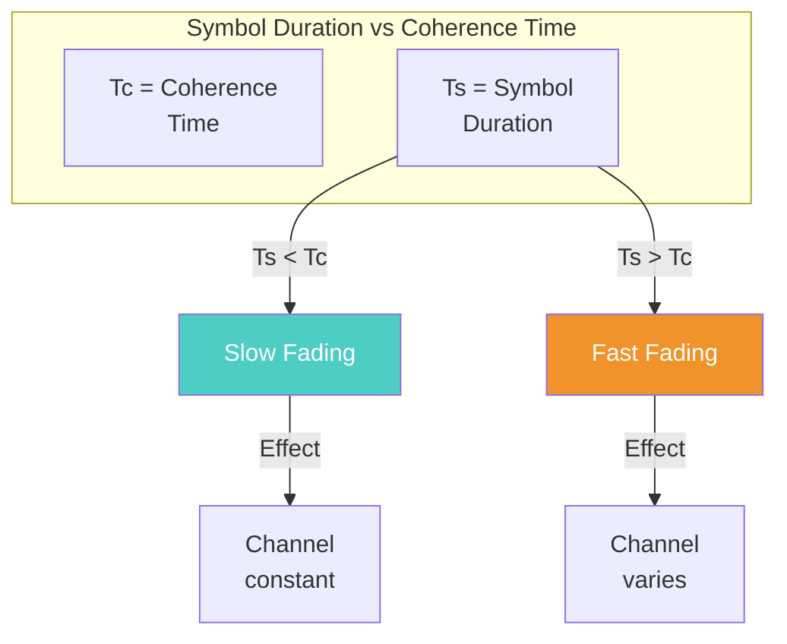

# Module 2 PYQ

---

## Differentiate between flat fading and frequency selective fading

**Answer:** [[May 2024.md#13. (a) Small scale fading: definition, types, flat vs frequency-selective (6 Marks)]]

### Quick Summary

| Aspect | Flat Fading | Frequency-Selective Fading |
|--------|-------------|----------------------------|
| **Condition** | $B_s \ll B_c$ | $B_s > B_c$ |
| **Delay Spread** | Small relative to symbol period | Significant; multiple resolvable paths |
| **Channel Model** | Single complex gain per symbol | FIR filter with multiple taps |
| **ISI** | Absent (negligible) | Present unless equalized/CP used |
| **Equalization** | One-tap (per subcarrier) | Multi-tap equalizer or OFDM needed |
| **Spectrum Distortion** | Uniform scaling | Frequency-dependent amplitude/phase |

### Key Points

- **Coherence Bandwidth ($B_c$):** $B_c \approx \frac{1}{5\tau_{rms}}$ to $\frac{1}{50\tau_{rms}}$
- If $B_s < B_c$ → Flat fading (all frequencies affected equally)
- If $B_s > B_c$ → Frequency-selective fading (different gains at different frequencies)

---

## Explain how Doppler spread affects wireless communication performance parameters

**Answer:** [[October 2023 PYQ.md#14. (c) Time selective fading]] | [[Module 2/Fading Theory]]

### Effect on Performance Parameters

Doppler spread $B_D$ (or maximum Doppler frequency $f_m$) directly impacts wireless communication in the following ways:

| Parameter | Effect of Doppler | Formula |
|-----------|-------------------|---------|
| **Coherence Time ($T_c$)** | Inverse relationship - higher Doppler → smaller $T_c$ | $T_c \approx \frac{0.423}{f_m} = \frac{0.423\lambda}{v}$ |
| **Channel Variability** | Faster fading with increased mobility | Rapid changes in amplitude/phase |
| **Symbol Error Rate** | Degrades performance if channel varies within symbol | Requires faster tracking |
| **Channel Estimation** | Needs more frequent estimation updates | Estimation overhead increases |
| **Equalization** | Time-varying channel causes residual ISI | Adaptive equalizers needed |
| **Interleaving Depth** | Requires longer interleaving for diversity | Trade-off with latency |
| **Modulation** | Lower-order modulations more robust | High Doppler limits adaptive modulation |

### Key Relationships

1. **Fast Fading Condition:** $T_s > T_c$
   - Symbol duration exceeds coherence time
   - Channel changes during symbol transmission
   - Causes inter-symbol interference and detection errors

2. **Slow Fading Condition:** $T_s < T_c$
   - Channel appears constant during symbol
   - Easier to equalize and demodulate

### Practical Examples

| Scenario | Velocity | $f_m$ @ 2 GHz | $T_c$ | Effect |
|----------|----------|---------------|-------|--------|
| Pedestrian | 3 km/h | 5.5 Hz | 77 ms | Slow fading |
| Vehicle | 60 km/h | 111 Hz | 3.8 ms | Moderate |
| High-speed train | 300 km/h | 556 Hz | 0.76 ms | Fast fading |

### Mitigation Techniques

- **Diversity:** Time diversity via interleaving and coding
- **Adaptive equalization:** Track time-varying channels
- **Pilot symbols:** Frequent channel estimation
- **Lower symbol rates:** Increase $T_s$ relative to $T_c$

---

## Describe the different types of fading in a wireless system. How do they impact signal reception?

**Answer:** [[May 2024.md#13. (a) Small scale fading: definition, types, flat vs frequency-selective (6 Marks)]]

### What is Fading?

**Fading** is the time variation of received signal power caused by changes in the transmission medium or propagation paths. In wireless systems, fading is broadly categorized into:

1. **Large-Scale Fading**
2. **Small-Scale Fading**

### Multipath Propagation ( Causes of Fading)

Multiple signal paths arrive at receiver with different delays and phases → constructive/destructive interference → fading.

### Classification of Fading Types

---

### 1. Large-Scale Fading

Represents the variation of signal strength over **large distances** (typically on the order of a cell size) and is generally frequency-independent.

| Type | Cause | Impact |
|------|-------|--------|
| **Path Loss** | Signal spreads over larger area with distance | Continuous, predictable drop in average received power |
| **Shadowing Effect** | Obstructed by buildings, hills, mountains | Long-term fluctuations depending on position |

**Distribution:** Log-normal

**Impact:** Determines cell coverage and range planning. Requires link budget margin.

### Large-Scale Fading (Visual)

---

### 2. Small-Scale Fading

Involves rapid fluctuations in received signal strength over **very short distances** (on the order of carrier wavelength) and short time periods. Primarily driven by **multipath interference**.

### Small-Scale Fading (Multipath)

#### A. Based on Multipath Time Delay Spread (Frequency Domain Effects)

| Type | Condition | Impact |
|------|----------|--------|
| **Flat Fading** | $B_s < B_c$ | All frequency components fluctuate simultaneously. Preserves spectral characteristics but causes SNR drop. |
| **Frequency-Selective Fading** | $B_s > B_c$ | Different spectral components affected by different amplitudes. Causes **ISI** (Inter-Symbol Interference). Much more difficult to decode. |

- **Flat Fading**: Channel has constant gain over signal bandwidth. Signal strength drops but shape preserved.
- **Frequency-Selective**: Multipath delay spread > symbol period. Multiple delayed versions cause time dispersion and ISI.

### Flat vs Frequency-Selective

#### B. Based on Doppler Spread (Time Domain Effects)

| Type | Condition | Impact |
|------|----------|--------|
| **Fast Fading** | $T_s > T_c$ | Channel impulse response changes rapidly within symbol. Creates ISI. Destructive interference from reflected signals. |
| **Slow Fading** | $T_s < T_c$ | Channel variations slower than modulation. Attenuation constant over symbol. Results in SNR loss overcome by error correction or diversity. |

- **Fast Fading**: High Doppler spread → rapid channel variations → linear distortion of baseband pulse
- **Slow Fading**: Low Doppler spread → channel nearly constant during symbol

### Slow vs Fast Fading

---

### Impact Summary

| Fading Type | Effect | Solution |
|------------|--------|------------|
| Large-Scale | Coverage/range planning | Link budget margin |
| Flat Fading | SNR drop | Fade margin, diversity |
| Freq-Selective | ISI | OFDM, equalization |
| Fast Fading | ISI, phase errors | Diversity, tracking |
| Slow Fading | SNR loss | Error correction coding |

---

### Classification Matrix

| | Flat Fading | Frequency-Selective |
|---|-------------|---------------------|
| **Slow** | Slow + Flat | Slow + Freq-Selective |
| **Fast** | Fast + Flat | Fast + Freq-Selective |

**Best Case**: Slow + Flat | **Worst Case**: Fast + Frequency-Selective

---

## What is diversity and how does it reduce fading?

**Diversity** is a technique that transmits the same information over **multiple independent channels** (in time, frequency, or space) to combat fading.

### How It Reduces Fading

- If one path is in fade, another may have good signal
- Statistical averaging reduces overall outage probability
- Provides **diversity gain** without increasing power

### Types of Diversity

| Type | Description |
|------|-------------|
| **Time Diversity** | Interleaving + coding across time slots |
| **Frequency Diversity** | Multiple carriers, spread spectrum |
| **Space Diversity** | Multiple antennas (MIMO) |
| **Polarization Diversity** | Different antenna polarizations |

---

## Compare selection combining and maximal ratio combining techniques.

| Aspect | Selection Combining (SC) | Maximal Ratio Combining (MRC) |
|--------|---------------------------|-------------------------------|
| **Principle** | Pick the branch with highest SNR | Weight and combine all branches |
| **Complexity** | Low (one RF chain) | High (all branches) |
| **Performance** | Moderate | Optimal |
| **SNR Output** | $\gamma = \max(\gamma_1, \gamma_2, ...)$ | $\gamma = \sum \gamma_i$ |
| **Gain** | Lower diversity gain | Highest diversity gain |
| **Implementation** | Simpler switches | Complex weighting |

### Selection Combining (SC)
- Selects the antenna branch with **highest instantaneous SNR**
- Uses only one branch for detection
- **Simple, low cost**, but **suboptimal** (discard other branch energy)

### Maximal Ratio Combining (MRC)
- Weights each branch by its channel gain
- **Combines all branches** constructively
- **Optimal performance** but **higher complexity**
- Provides maximum diversity gain

### Comparison Table

| Feature | SC | MRC |
|---------|-----|------|
| SNR Improvement | Moderate | Maximum |
| Complexity | Lowest | Highest |
| RF Chains | 1 (switched) | All active |
| Diversity Order | N (but suboptimal) | N (optimal) |
| Use Case | Simple receivers | Advanced systems |

---

### Related Questions

- [[May 2024.md#3. Multipath causing small-scale fading (3 Marks)]]
- [[October 2023 PYQ.md#3. How does fading occur? Derive the expression for doppler shift.]]
- [[Module 2/Statistical Multipath Channel Models]]