# Module 2 PYQ

---

## Table of Contents

1. [Differentiate between flat fading and frequency selective fading](#differentiate-between-flat-fading-and-frequency-selective-fading-1)
2. [Explain how Doppler spread affects wireless communication performance parameters](#explain-how-doppler-spread-affects-wireless-communication-performance-parameters)
3. [Describe the different types of fading in a wireless system. How do they impact signal reception?](#describe-the-different-types-of-fading-in-a-wireless-system-how-do-they-impact-signal-reception)
   - [What is Fading?](#what-is-fading)
   - [Classification of Fading Types](#classification-of-fading-types)
   - [1. Large-Scale Fading](#1-large-scale-fading)
   - [2. Small-Scale Fading](#2-small-scale-fading)
     - [A. Based on Multipath Time Delay Spread (Frequency Domain Effects)](#a-based-on-multipath-time-delay-spread-frequency-domain-effects)
     - [B. Based on Doppler Spread (Time Domain Effects)](#b-based-on-doppler-spread-time-domain-effects)
     - [Impact Summary](#impact-summary)
     - [Classification Matrix](#classification-matrix)
4. [What is diversity and how does it reduce fading?](#what-is-diversity-and-how-does-it-reduce-fading) → [[Module 2/Diversity|Diversity]]
5. [Compare selection combining and maximal ratio combining techniques.](#compare-selection-combining-and-maximal-ratio-combining-techniques) → [[Module 2/Diversity|SC/MRC]]
6. [Discuss the impact of shadowing on wireless channel performance. (7 Marks)](#discuss-the-impact-of-shadowing-on-wireless-channel-performance-7-marks) → [[Module 2/Path Loss|Shadowing]]
7. [A wireless signal has a Doppler shift of 150 Hz when moving at 60 km/h. Determine the original frequency of the signal. (7 Marks)](#a-wireless-signal-has-a-doppler-shift-of-150-hz-when-moving-at-60-kmh-determine-the-original-frequency-of-the-signal-7-marks) → [[Module 2/Doppler Shift|Doppler Calc]]
8. [Define the Shannon capacity theorem in the context of wireless communication. How does it set the upper limit for data transmission in a given channel? (7 Marks)](#define-the-shannon-capacity-theorem-in-the-context-of-wireless-communication-how-does-it-set-the-upper-limit-for-data-transmission-in-a-given-channel-7-marks) → [[Module 2/Shannon Capacity| capacity]]
9. [How does fading occur? Derive the expression for Doppler shift.](#how-does-fading-occur-derive-the-expression-for-doppler-shift)
   - [Multipath Propagation](#multipath-propagation-1)
   - [Derivation of the Doppler Shift Expression](#derivation-of-the-doppler-shift-expression)

---

## Differentiate between flat fading and frequency selective fading

**Answer:** [[May 2024.md#13. (a) Small scale fading: definition, types, flat vs frequency-selective (6 Marks)]]

### Quick Summary

| Aspect | Flat Fading | Frequency-Selective Fading |
|--------|-------------|----------------------------|
| **Condition** | $B_s \ll B_c$ | $B_s > B_c$ |
| **Delay Spread** | Small relative to symbol period | Significant; multiple resolvable paths |
| **Channel Model** | Single complex gain per symbol | FIR filter with multiple taps |
| **ISI** | Absent (negligible) | Present unless equalized/CP used |
| **Equalization** | One-tap (per subcarrier) | Multi-tap equalizer or OFDM needed |
| **Spectrum Distortion** | Uniform scaling | Frequency-dependent amplitude/phase |

### Key Points

- **Coherence Bandwidth ($B_c$):** $B_c \approx \frac{1}{5\tau_{rms}}$ to $\frac{1}{50\tau_{rms}}$
- If $B_s < B_c$ → Flat fading (all frequencies affected equally)
- If $B_s > B_c$ → Frequency-selective fading (different gains at different frequencies)

---

## Explain how Doppler spread affects wireless communication performance parameters

**Answer:** [[October 2023 PYQ.md#14. (c) Time selective fading]] | [[Module 2/Fading Theory]]

### Effect on Performance Parameters

Doppler spread $B_D$ (or maximum Doppler frequency $f_m$) directly impacts wireless communication in the following ways:

| Parameter | Effect of Doppler | Formula |
|-----------|-------------------|---------|
| **Coherence Time ($T_c$)** | Inverse relationship - higher Doppler → smaller $T_c$ | $T_c \approx \frac{0.423}{f_m} = \frac{0.423\lambda}{v}$ |
| **Channel Variability** | Faster fading with increased mobility | Rapid changes in amplitude/phase |
| **Symbol Error Rate** | Degrades performance if channel varies within symbol | Requires faster tracking |
| **Channel Estimation** | Needs more frequent estimation updates | Estimation overhead increases |
| **Equalization** | Time-varying channel causes residual ISI | Adaptive equalizers needed |
| **Interleaving Depth** | Requires longer interleaving for diversity | Trade-off with latency |
| **Modulation** | Lower-order modulations more robust | High Doppler limits adaptive modulation |

### Key Relationships

1. **Fast Fading Condition:** $T_s > T_c$
   - Symbol duration exceeds coherence time
   - Channel changes during symbol transmission
   - Causes inter-symbol interference and detection errors

2. **Slow Fading Condition:** $T_s < T_c$
   - Channel appears constant during symbol
   - Easier to equalize and demodulate

### Practical Examples

| Scenario | Velocity | $f_m$ @ 2 GHz | $T_c$ | Effect |
|----------|----------|---------------|-------|--------|
| Pedestrian | 3 km/h | 5.5 Hz | 77 ms | Slow fading |
| Vehicle | 60 km/h | 111 Hz | 3.8 ms | Moderate |
| High-speed train | 300 km/h | 556 Hz | 0.76 ms | Fast fading |

### Mitigation Techniques

- **Diversity:** Time diversity via interleaving and coding
- **Adaptive equalization:** Track time-varying channels
- **Pilot symbols:** Frequent channel estimation
- **Lower symbol rates:** Increase $T_s$ relative to $T_c$

---

## Describe the different types of fading in a wireless system. How do they impact signal reception?

**Answer:** [[May 2024.md#13. (a) Small scale fading: definition, types, flat vs frequency-selective (6 Marks)]]

### What is Fading?

See: [[Fading]]

**Fading** is the time variation of received signal power caused by changes in the transmission medium or propagation paths. In wireless systems, fading is broadly categorized into:

1. **Large-Scale Fading**
2. **Small-Scale Fading**

### Multipath Propagation ( Causes of Fading)

See: [[Multipath Propagation]]

### Classification of Fading Types

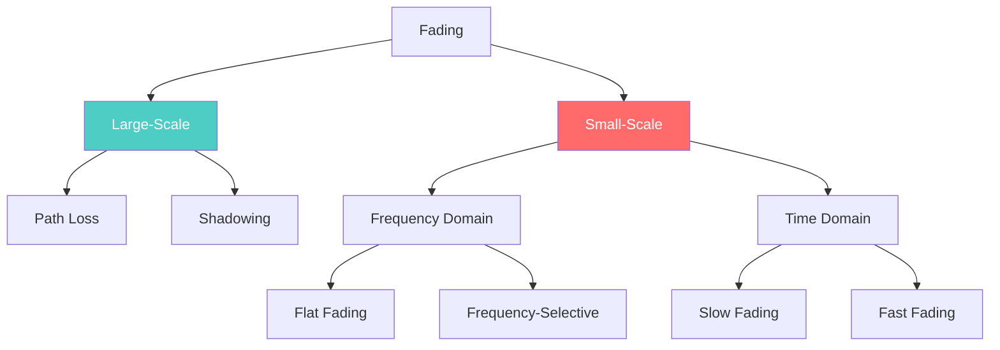

---

### 1. Large-Scale Fading

Represents the variation of signal strength over **large distances** (typically on the order of a cell size) and is generally frequency-independent.

| Type | Cause | Impact |
|------|-------|--------|
| **Path Loss** | Signal spreads over larger area with distance | Continuous, predictable drop in average received power |

See: [[Path Loss]]

| **Shadowing Effect** | Obstructed by buildings, hills, mountains | Long-term fluctuations depending on position |

**Distribution:** Log-normal

**Impact:** Determines cell coverage and range planning. Requires link budget margin.

### Large-Scale Fading (Visual)

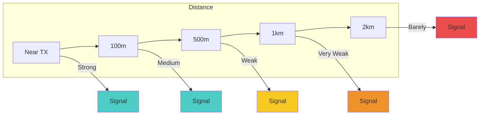

---

### 2. Small-Scale Fading

Involves rapid fluctuations in received signal strength over **very short distances** (on the order of carrier wavelength) and short time periods. Primarily driven by **multipath interference**.

### Small-Scale Fading (Multipath)

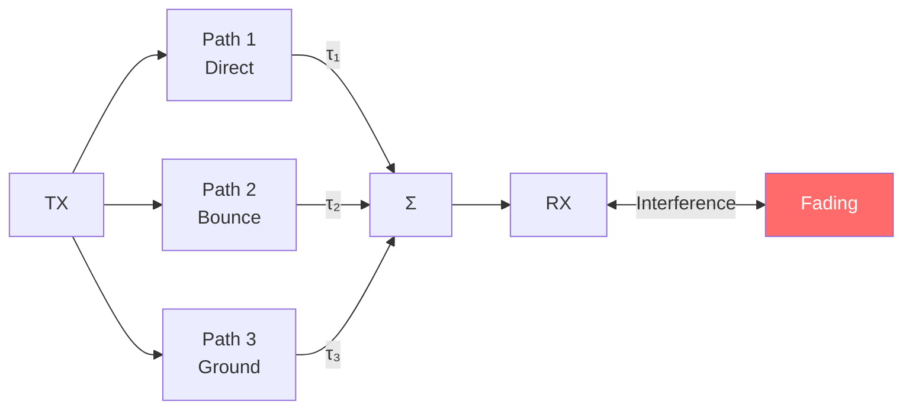

#### A. Based on Multipath Time Delay Spread (Frequency Domain Effects)

| Type | Condition | Impact |
|------|----------|--------|
| **Flat Fading** | $B_s < B_c$ | All frequency components fluctuate simultaneously. Preserves spectral characteristics but causes SNR drop. |
| **Frequency-Selective Fading** | $B_s > B_c$ | Different spectral components affected by different amplitudes. Causes **ISI** (Inter-Symbol Interference). Much more difficult to decode. |

- **Flat Fading**: Channel has constant gain over signal bandwidth. Signal strength drops but shape preserved.
- **Frequency-Selective**: Multipath delay spread > symbol period. Multiple delayed versions cause time dispersion and ISI.

### Flat vs Frequency-Selective

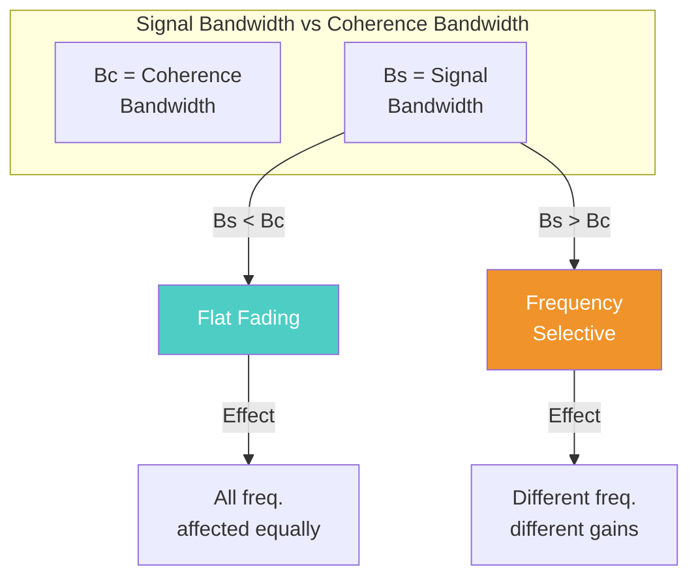

#### B. Based on Doppler Spread (Time Domain Effects)

| Type | Condition | Impact |
|------|----------|--------|
| **Fast Fading** | $T_s > T_c$ | Channel impulse response changes rapidly within symbol. Creates ISI. Destructive interference from reflected signals. |
| **Slow Fading** | $T_s < T_c$ | Channel variations slower than modulation. Attenuation constant over symbol. Results in SNR loss overcome by error correction or diversity. |

- **Fast Fading**: High Doppler spread → rapid channel variations → linear distortion of baseband pulse
- **Slow Fading**: Low Doppler spread → channel nearly constant during symbol

### Slow vs Fast Fading

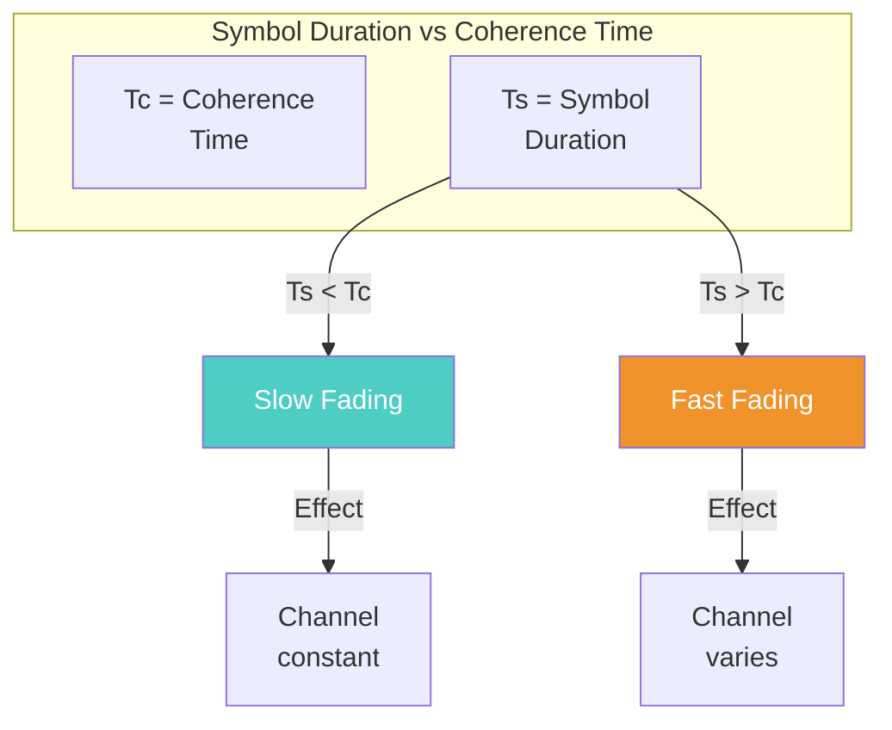

---

### Impact Summary

| Fading Type | Effect | Solution |
|------------|--------|------------|
| Large-Scale | Coverage/range planning | Link budget margin |
| Flat Fading | SNR drop | Fade margin, diversity |
| Freq-Selective | ISI | OFDM, equalization |
| Fast Fading | ISI, phase errors | Diversity, tracking |
| Slow Fading | SNR loss | Error correction coding |

---

### Classification Matrix

| | Flat Fading | Frequency-Selective |
|---|-------------|---------------------|
| **Slow** | Slow + Flat | Slow + Freq-Selective |
| **Fast** | Fast + Flat | Fast + Freq-Selective |

**Best Case**: Slow + Flat | **Worst Case**: Fast + Frequency-Selective

---

## What is diversity and how does it reduce fading?

**Diversity** is a technique that transmits the same information over **multiple independent channels** (in time, frequency, or space) to combat fading.

### How It Reduces Fading

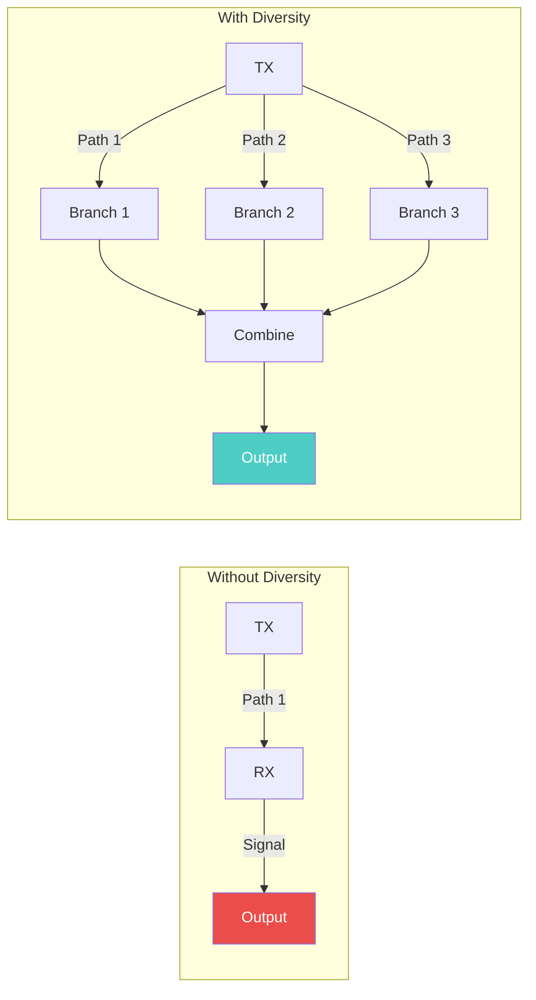

- If one path is in fade, another may have good signal
- Statistical averaging reduces overall outage probability
- Provides **diversity gain** without increasing power

### Types of Diversity

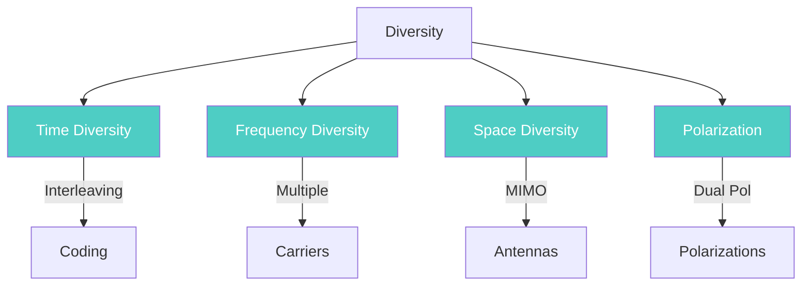

| Type | Description |
|------|-------------|
| **Time Diversity** | Interleaving + coding across time slots |
| **Frequency Diversity** | Multiple carriers, spread spectrum |
| **Space Diversity** | Multiple antennas (MIMO) |
| **Polarization Diversity** | Different antenna polarizations |

---

## Compare selection combining and maximal ratio combining techniques.

### Selection Combining (SC)

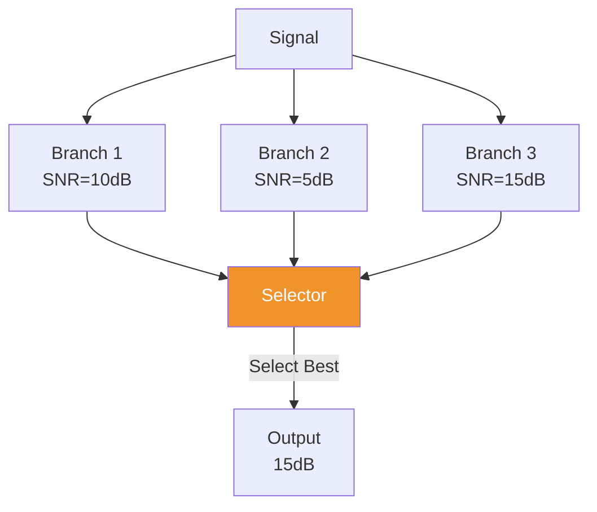

- Selects the antenna branch with **highest instantaneous SNR**
- Uses only one branch for detection
- **Simple, low cost**, but **suboptimal** (discard other branch energy)

### Maximal Ratio Combining (MRC)

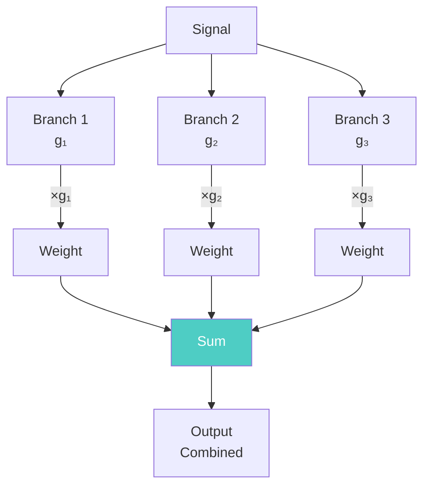

- Weights each branch by its channel gain
- **Combines all branches** constructively
- **Optimal performance** but **higher complexity**
- Provides maximum diversity gain

| Aspect | Selection Combining (SC) | Maximal Ratio Combining (MRC) |
|--------|---------------------------|-------------------------------|
| **Principle** | Pick the highest SNR | Weight and combine all |
| **Complexity** | Low (one RF chain) | High (all branches) |
| **Performance** | Moderate | Optimal |
| **SNR Output** | $\gamma = \max(\gamma_1, \gamma_2, ...)$ | $\gamma = \sum \gamma_i$ |
| **Gain** | Lower diversity gain | Highest diversity gain |

### Comparison Table

| Feature | SC | MRC |
|---------|-----|------|
| SNR Improvement | Moderate | Maximum |
| Complexity | Lowest | Highest |
| RF Chains | 1 (switched) | All active |
| Diversity Order | N (suboptimal) | N (optimal) |
| Use Case | Simple receivers | Advanced systems |

---

## Discuss the impact of shadowing on wireless channel performance. (7 Marks)

### Definition

**Shadowing** is the **deviation** of a received electromagnetic signal's power from its expected average value. It is a form of **large-scale fading** that occurs when large terrain features or obstacles—such as buildings, hills, mountains, or trees—block or obstruct the direct propagation path between the transmitter and the receiver.

Unlike path loss which varies **predictably** with distance (following a dⁿ law), shadowing is **random** and depends on the specific obstacles in the environment.

---

### Detailed Impact on Wireless Channel Performance

#### 1. Signal Strength Reduction
- Acts as a primary form of **large-scale fading**
- Causes significant reduction in overall signal strength when the direct path is blocked
- Additional attenuation beyond what path loss models predict
- Can cause 10-20+ dB of signal loss

#### 2. Power Fluctuations
- Received signal power experiences **large fluctuations** depending on:
  - Geographical position of the receiver
  - Radio frequency being used
  - Size and density of obstructing obstacles
- These fluctuations are experienced on **local-mean powers** (short-term averages used to separate shadowing from rapid multipath fading)

#### 3. Slow Fading
- Shadowing is the direct cause of **slow fading**
- Unlike multipath fading which happens rapidly (fractions of a second), shadow fading **lasts for multiple seconds or minutes**
- This is a much **slower time-scale phenomenon**

#### 4. Loss of Signal-to-Noise Ratio (SNR)
- The ultimate performance impact of slow fading induced by shadowing is a **loss of SNR**
- This **degrades the reliability** of the communication link
- Can lead to call drops, data errors, or connection loss

#### 5. Coverage Issues
- Creates **coverage holes** or dead zones in shadowed regions
- Cell edges become unpredictable
- Harder to plan cell boundaries

#### 6. Impact on System Design
- Must design **link budget margins** to combat shadowing (typically 10-20 dB)
- Affects handoff decisions - may trigger unnecessary handoffs
- Reduces effective cell capacity in shadowed areas

---

### Statistical Modeling

Because the mean envelope level of the signal becomes a **random variable** due to these shadow variations, channel performance models must account for it:

$$P_{dB} \sim \mathcal{N}(\mu, \sigma^2)$$

Where:
- $\mu$ = mean path loss (dB)
- $\sigma$ = standard deviation (typically 4-12 dB for urban environments)

**Distribution**: Log-normal (based on empirical observations)

### Visual Representation

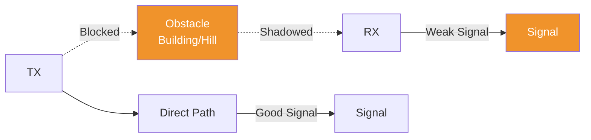

### Mitigation Techniques

| Technique | How it Helps |
|-----------|-------------|
| **Link Budget Margin** | Extra power to overcome shadow fades |
| **Diversity** | Multiple antennas/paths average out effects |
| **Power Control** | Increase power in shadowed areas |
| **Microcells** | Smaller cells reduce blockage probability |

### Comparison: Path Loss vs Shadowing

See: [[Path Loss]]

| Property | Path Loss | Shadowing |
|----------|----------|-----------|
| **Scale** | Deterministic with distance | Random position-dependent |
| **Variations** | Predictable (d^n law) | Unpredictable (log-normal) |
| **Rate** | Slow, gradual | Rapid position changes |
| **Solution** | Cell planning | Margin + diversity |

### Key Takeaways

1. Shadowing causes **random fluctuations** around path loss mean
2. Creates **coverage holes** in shadowed regions
3. Requires **link budget margin** (typically 10-20 dB) for reliable coverage
4. Mitigated through **diversity** and **power control**
5. Combined with path loss → determines overall cell coverage

---

## A wireless signal has a Doppler shift of 150 Hz when moving at 60 km/h. Determine the original frequency of the signal. (7 Marks)

### Given

- Doppler shift: $f_d = 150$ Hz
- Velocity: $v = 60$ km/h

### Formula

Doppler shift:
  $$f_d = \frac{v}{\lambda} \cos\theta = f_m \cos\theta$$
For maximum Doppler (θ = 0°):
  $$f_d = f_m = \frac{v}{\lambda} = \frac{vf_c}{c}$$

$$\boxed{f_c = \frac{f_d \cdot c}{v}}$$

Where:
- $c = 3 \times 10^8$ m/s (speed of light)
- $v = 60$ km/h = $16.67$ m/s

### Calculation

$$f_c = \frac{150 \times 3 \times 10^8}{16.67}$$

$$f_c = \frac{150 \times 3\times 10^8}{16.67} = \frac{4.5 \times 10^{10}}{16.67}$$

$$f_c = 2.7 \times 10^9 \text{ Hz} = 2.7 \text{ GHz}$$

### Answer

The original carrier frequency is **2.7 GHz**.

---

## Define the Shannon capacity theorem in the context of wireless communication. How does it set the upper limit for data transmission in a given channel? (7 Marks)

See: [[Module 2/Shannon Capacity|Shannon Capacity Note]]

**Answer:** [[October 2023 PYQ.md#14. (b) Inference of AWGN channel capacity]]

### Definition

**Shannon's capacity theorem** characterizes the **fundamental limits** of reliable communication over a noisy channel.

**Historical Context:** Before Shannon formulated information theory in 1948, it was widely believed that the only way to achieve reliable communication (making error probability as small as desired) was to drastically reduce data rate (e.g., repeating the same message over and over). **Shannon proved this incorrect** - through intelligent coding, a system can communicate at a strictly positive data rate while maintaining an arbitrarily small error probability.

### The Channel Capacity Limit

The theorem establishes a **maximal rate**, known as the **channel capacity (C)**, at which highly reliable communication can occur:

$$\boxed{C = B \log_2(1 + \text{SNR})}$$

**Key Principle:** If a system attempts to transmit data at a rate **exceeding** channel capacity, it becomes **fundamentally impossible** to drive error probability to zero. The channel capacity serves as the **absolute upper limit** for reliable data transmission.

### Relationship to Bandwidth and Power

For a standard **Additive White Gaussian Noise (AWGN)** wireless channel:

$$C = W \log_2\left(1 + \frac{\bar{P}}{N_0 W}\right)$$

Where:
- $W$ = Channel bandwidth (Hz)
- $\bar{P}$ = Average received power
- $N_0$ = Noise power spectral density

| Parameter | Physical Meaning |
|-----------|--------------|
| $W$ or $B$ | Available spectrum |
| $\bar{P}$ | Signal power |
| $N_0$ | Noise floor |
| $C$ | Maximum achievable data rate |

### Spectral Efficiency

The limit can be expressed as **maximum achievable spectral efficiency** based on SNR:

$$\eta = \log_2(1 + \text{SNR}) \text{ bits/s/Hz}$$

### Key Implications

1. **Bandwidth Tradeoff**
   - Doubling bandwidth roughly doubles capacity (linear relationship with B)
   - Each additional 3 dB SNR adds approximately $B$ bits/s at high SNR

2. **Power Tradeoff**
   - Capacity grows logarithmically with power (diminishing returns)
   - At high SNR: need 3 dB more power to increase capacity by $B$ bits/s
   - At low SNR: $C \approx \frac{B}{\ln 2}\text{SNR}$ (nearly linear!)

3. **Fundamental Limit**
   - $C$ is the absolute theoretical limit
   - No practical system can exceed this without errors
   - Guides modulation/coding design

### Visual Representation

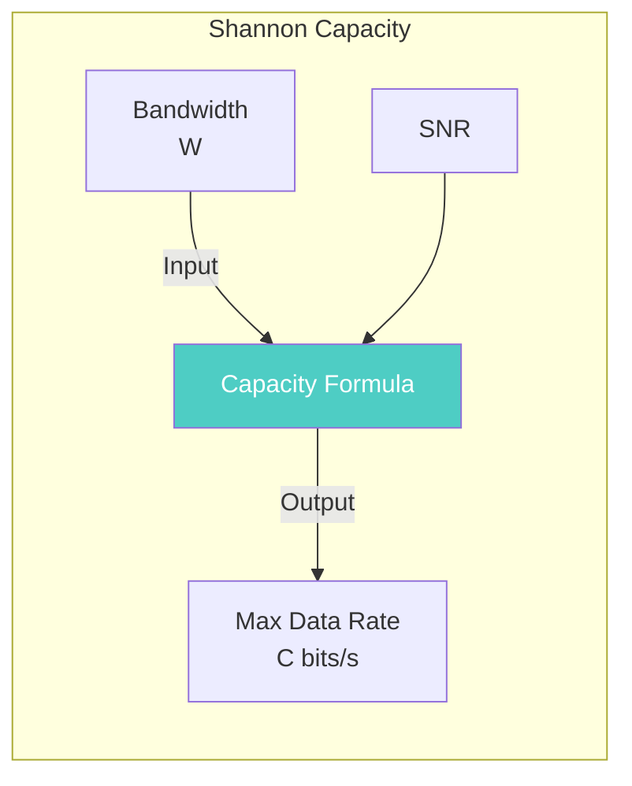

### Practical Example

For a channel with $B = 1$ MHz and $\text{SNR} = 100$ (20 dB):

$$C = 1 \times 10^6 \times \log_2(1 + 100)$$
$$C = 1 \times 10^6 \times \log_2(101)$$
$$C = 1 \times 10^6 \times 6.658$$
$$C \approx 6.66 \text{ Mbps}$$

### Limitations

Shannon capacity assumes:
- Perfect channel coding (optimal codes)
- AWGN (only white Gaussian noise)
- Perfect knowledge of channel at transmitter/receiver

In practice, real systems operate **below** this limit due to:
- Practical coding limitations
- Implementation complexity
- Other interference

### Key Takeaways

1. **Fundamental limit** - no system can exceed without errors
2. **Bandwidth-limited**: Capacity grows linearly with B
3. **Power-limited**: Capacity grows logarithmically with SNR
4. **Guides design**: Determines tradeoff between B, power, and rate
5. **Practical goal**: Get as close as possible to Shannon limit
6. **Coding enables** reliable communication at rates approaching limit

---

---

## How does fading occur? Derive the expression for Doppler shift.

**Fading** is the random variation in a signal's amplitude, phase, or angle of arrival as it travels through a wireless communication channel.

It occurs primarily due to two physical phenomena:

### 1. Multipath Propagation

See: [[Multipath Propagation]]

### 2. Relative Motion and Environmental Changes

When the transmitter, receiver, or surrounding objects are in motion, the relative phases of the arriving multipath components change constantly. This continuous shifting causes the received signal's amplitude to fluctuate rapidly over short distances or time periods — **small-scale fading**. Large terrain features can physically block radio waves, causing slower fluctuations known as **shadowing** or **large-scale fading**.

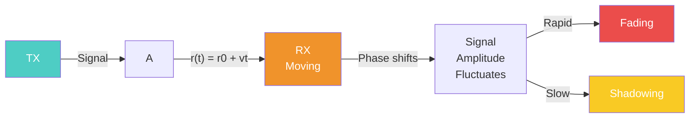

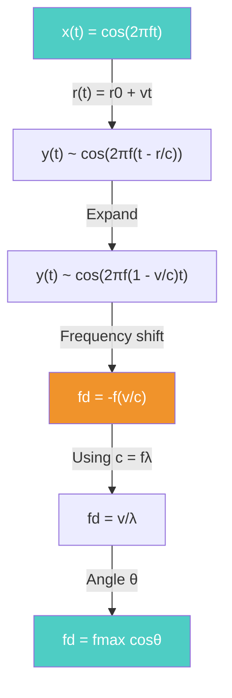

---

### Derivation of the Doppler Shift Expression

See: [[Doppler Shift]]

The Doppler shift arises because the relative motion between the transmitter and receiver changes the apparent frequency of the signal over time.

**Step 1:** Assume a fixed transmit antenna sends a sinusoidal signal with frequency $f$:
$$x(t) = \cos(2\pi ft)$$

**Step 2:** A receive antenna moves away from the transmitter at velocity $v$. The distance is $r(t) = r_0 + vt$.

**Step 3:** The signal experiences time-varying propagation delay $r(t)/c$:
$$y(t) \propto \cos\left(2\pi f\left(t - \frac{r_0 + vt}{c}\right)\right)$$

> [!callout] **Step 3→4 Expansion Explained**
> $$= \cos\left(2\pi f t - \frac{2\pi f r_0}{c} - \frac{2\pi f v t}{c}\right)$$
> $$= \cos\left(2\pi f \left(1 - \frac{v}{c}\right)t - \frac{2\pi f r_0}{c}\right)$$
>
> | Term | Meaning |
> |-----|---------|
> | $2\pi f t$ | Original signal component |
> | $2\pi f r_0/c$ | Fixed phase offset (initial distance) |
> | $2\pi f (v/c)t$ | **New term** from relative motion |
> | $(1 - v/c)$ | Frequency scaling factor |

**Step 4:** Expand:
$$y(t) \propto \cos\left(2\pi f\left(1 - \frac{v}{c}\right)t - \frac{2\pi fr_0}{c}\right)$$

The new apparent frequency is $f\left(1 - \frac{v}{c}\right)$.

**Step 5:** The Doppler shift is:
$$f_d = -f\frac{v}{c}$$

Using $c = f\lambda$:
$$\boxed{f_m = \frac{v}{\lambda}}$$

**Step 6:** For a signal path at angle $\theta$ relative to direction of motion:
$$\boxed{f_d = \frac{v}{\lambda}\cos\theta = f_m\cos\theta}$$

Where:
- $v$ = velocity (m/s)
- $\lambda$ = wavelength
- $f_c$ = carrier frequency
- $c$ = speed of light (3×10⁸ m/s)
- $f_m$ = maximum Doppler shift

---

### Related Questions

- [[May 2024.md#3. Multipath causing small-scale fading (3 Marks)]]
- [[October 2023 PYQ.md#3. How does fading occur? Derive the expression for doppler shift.]]
- [[Module 2/Statistical Multipath Channel Models]]
