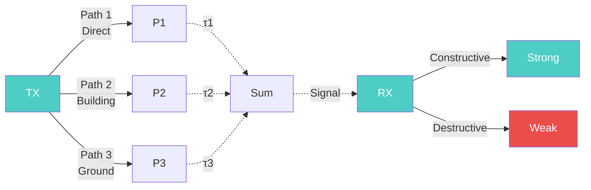

# Multipath Propagation

Unlike signals in a wired channel, wireless signals bounce off various obstacles such as buildings, trees, and the ground. This scattering creates multiple "copies" of the transmitted signal that reach the receiver via different paths, each with a different length, time delay, and phase. When these multiple copies arrive at the receiver, their electromagnetic waves interact:

| Condition | Result |
|-----------|--------|
| In-phase (constructive) | Signal strength boosted |
| Out-of-phase (destructive) | Signal fades |

---

## Key Concepts

- **Multipath** = multiple signal paths from TX to RX
- Each path has: **delay (τ)**, **phase**, **amplitude**
- Paths sum at receiver → **constructive** or **destructive** interference
- Causes **fading** in wireless channels

---

## Related Topics

- [[Module 2 PYQ#how-does-fading-occur-derive-the-expression-for-doppler-shift|Fading & Doppler]]
- [[Module 2 PYQ|Module 2 PYQ - Fading Types]]
- [[Fading Theory]]
- [[Statistical Multipath Channel Models]]