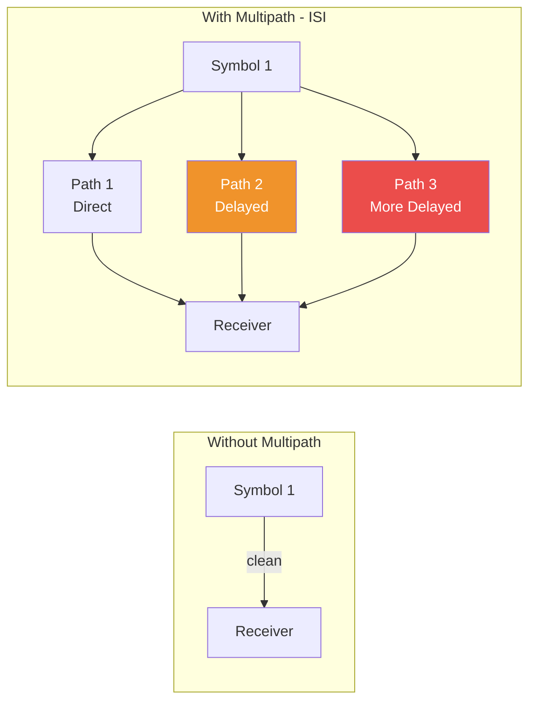
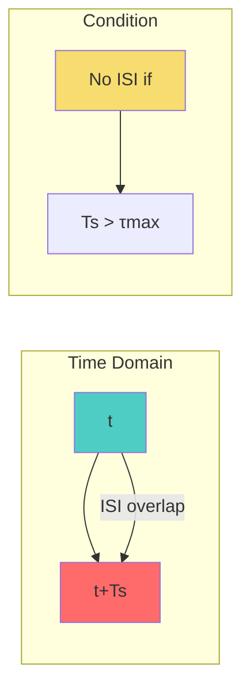

# Inter-Symbol Interference (ISI)

> [!abstract]- One-line summary
> ISI occurs when adjacent symbols overlap in time due to channel delay spread, causing errors in detection.

---

## Definition

**Inter-Symbol Interference (ISI)** = The spreading of a symbol into adjacent time slots, causing adjacent symbols to overlap and interfere with each other.

---

## Key Formula

$$ISI = \frac{\text{Energy spreading beyond symbol period}}{\text{Total symbol energy}}$$

**Condition for no ISI:**
$$T_s > \tau_{max}$$

Where:
- $T_s$ = Symbol period
- $\tau_{max}$ = Maximum channel delay spread

---

## Explanation

### Why it happens

ISI occurs due to **multipath propagation**[^1]:

1. Transmitted signal takes multiple paths
2. Each path has different length → different delay
3. Delayed copies arrive after the main symbol
4. These delayed copies spill into adjacent symbol periods
5. Receiver cannot distinguish where one symbol ends and another begins

### Visual Representation

---

## ISI Mitigation Techniques

| Technique | How it Works | Application |
|-----------|--------------|-------------|
| **Equalization** | Inverse filtering to remove ISI | Adaptive filters |
| **OFDM/Cyclic Prefix** | Converts linear convolution to circular | Wideband systems |
| **Raised Cosine Filtering** | Limits bandwidth, controls ISI | Pulse shaping |
| **MLSE** | Optimal sequence detection | Viterbi algorithm |

---

## Relationship with Channel Parameters

| Parameter | Relationship |
|------------|--------------|
| **Delay Spread ($\tau_{rms}$**) | Larger $\tau_{rms}$ → More ISI |
| **Symbol Duration ($T_s$)** | $T_s \gg \tau_{rms}$ → Less ISI |
| **Coherence Bandwidth ($B_c$)** | $B_c \approx 1/\tau_{rms}$ |

> [!tip] **Rule of Thumb**
> If $T_s > 10\tau_{rms}$, ISI is negligible.

---

## OFDM Solution

OFDM eliminates ISI using a **Cyclic Prefix (CP)**[^2]:

1. Copy last portion of symbol to front
2. Makes channel convolution "circular"
3. FFT transforms ISI to simple multiplication
4. One-tap equalization per subcarrier

**CP Length Requirement:**
$$T_{CP} \geq \tau_{max}$$

---

## Key Points

1. **Root cause**: Multipath propagation
2. **Problem**: Symbol overlap causes detection errors
3. **Solution**: Equalization or OFDM
4. **Condition**: $T_s > \tau_{max}$ for no ISI

---

> [!callout] **Common Mistakes**
> - Assuming ISI only occurs in wideband systems
> - Forgetting that delay spread increases with distance
> - Not considering the CP length in OFDM design

---

## Related Topics

- [[Module 2/Multipath Propagation|Multipath Propagation]]
- [[Module 2/Coherence|Coherence Bandwidth]]
- [[Module 3/MultiCarrier Modulation|OFDM]]
- [[Module 4/4.2 Equalization|Equalization]]

---

## PYQ Links

> [!tip]- Practice Questions
> - [[PYQs/October 2023#6. Explain the significance of using cyclic prefix in an OFDM system|Cyclic Prefix in OFDM]]
> - [[PYQs/May 2024#5. Multicarrier scheme eliminating ISI|ISI Elimination]]

---

[^1]: **Multipath Propagation** occurs when radio signals travel through multiple paths due to reflection, diffraction, and scattering. Each path has a different path length, resulting in different travel times (delays). These delayed copies overlap at the receiver, causing ISI. The delayed energy falling into adjacent symbol periods is the primary cause of ISI in wireless channels.

[^2]: **Cyclic Prefix (CP)** is a copy of the last portion of an OFDM symbol prepended to the beginning. It serves two purposes: (1) It provides a guard interval to absorb multipath delays, and (2) It makes the linear convolution appear circular, enabling simple FFT-based equalization that eliminates ISI entirely.