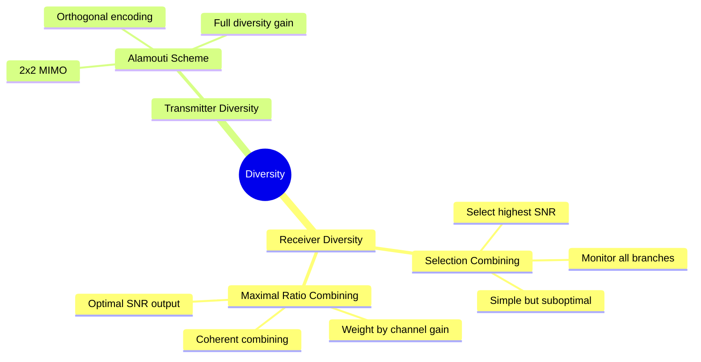
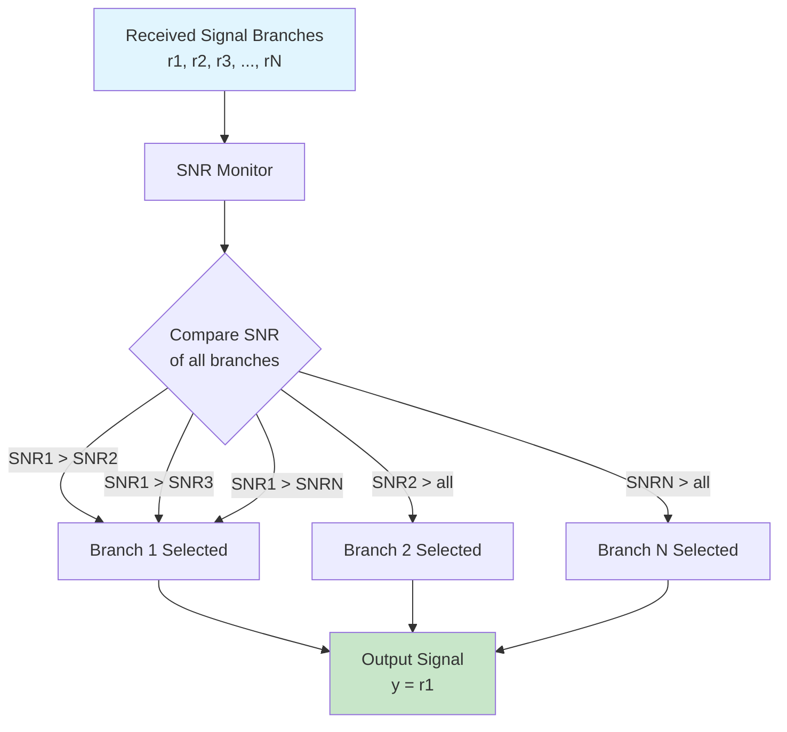

# 4.1 Diversity

Diversity is a technique used in wireless communication to **combat fading** and improve reliability by transmitting the **same information over multiple independent channels or paths**.
> [!success]-  **How it Reduces Fading**
> ## How It Reduces Fading
> ### 1. Path Independence
> - Wireless signals travel through multiple paths due to reflection, scattering, diffraction
> - Each path experiences independent fading
> - When one path is in a deep fade (weak signal), ***another path may have strong signal***
> ### 2. Statistical Averaging
> - By combining multiple independent paths, the overall signal is averaged
> - Probability that ALL paths are in fade simultaneously is very low
> - Reduces **outage probability** (chance of signal dropping below threshold)
> ### 3. Diversity Gain
> - The SNR gain obtained is called "diversity gain"
> - Does not require increasing transmit power
> - Error probability decreases as: P_e ∝ (SNR)^(-G_d)
> - G_d = diversity order (number of independent branches)
> ### Example:
> | Without Diversity | With Diversity (3 branches) |
> |------------------|---------------------------|
> | If 1 path fades → signal lost | If 1 path fades → 2 other paths still work |
> | High outage probability | Low outage probability |
> 


## 1.  Receiver Diversity

***Techniques where multiple antennas/replicas are at the receiver side.***

| Type                   | Description                                         | Application              |
| ---------------------- | --------------------------------------------------- | ------------------------ |
| **Space Diversity**    | Multiple antennas at receiver, physically separated | Cellular base stations   |
| **Receiver Diversity** | Multiple antennas at receiver                       | MRC, Selection Combining |


Receiver diversity involves having multiple antennas at the receiver to capture the transmitted signal through different paths. The receiver combines these signals to improve overall signal quality.



### Selection Combining

Selection combining is the simplest diversity technique where the receiver selects the signal with the highest SNR (Signal-to-Noise Ratio) from all available branches.

- **Principle**: Monitor SNR of all diversity branches, select the branch with the highest SNR
- **Advantage**: Simple implementation, no complex processing required
- **Disadvantage**: Only uses one branch's signal, wastes potential information from other branches
- **Performance**: Better than single antenna but not optimal



### Maximal Ratio Combining (MRC)

Maximal ratio combining is the optimal diversity technique where all received signals are weighted and combined based on their SNR.

- **Principle**: Each branch is weighted by its channel gain and combined coherently
- **Weight calculation**: w_i = h_i* / (|h_i|²) where h_i is the channel coefficient of i-th branch
- **Output**: y = Σ w_i * r_i where r_i is the received signal on i-th branch
- **Advantage**: Maximizes SNR at the output, provides best diversity gain
- **Disadvantage**: Requires knowledge of channel coefficients, more complex than selection combining
- **Performance**: Achieves maximum diversity order equal to number of branches

```mermaid
flowchart TD
    A[Received Signal Branches<br/>r1, r2, r3, ..., rN] --> B[Channel Estimation]
    B --> C[Calculate Weights<br/>wi = hi* / |hi|²]
    C --> D[Weighted Combination<br/>y = Σ wi × ri]
    D --> E[Output Signal<br/>Maximum SNR]
    
    style A fill:#e1f5fe
    style E fill:#c8e6c9
```

## Transmitter Diversity

***Techniques where multiple antennas/replicas are at the transmitter side.***


| Type | Description | Application |
|------|-------------|-------------|
| **Space Diversity** | Multiple antennas at transmitter, physically separated | MIMO systems |
| **Transmitter Diversity** | Multiple antennas at transmitter | Alamouti scheme |


Transmitter diversity involves sending redundant information from multiple transmit antennas to improve reliability.

### Alamouti Scheme (2x2 MIMO)

The Alamouti scheme is a famous space-time block coding (STBC) scheme that provides full diversity gain with two transmit antennas.

#### Encoding (2 Tx Antennas)

For two consecutive symbol periods, two symbols (s1 and s2) are transmitted:

| Time | Antenna 1 | Antenna 2 |
|------|-----------|-----------|
| t    | s1        | s2        |
| t+T  | -s2*      | s1*       |

- **Encoding Matrix**: S = [[s1, s2], [-s2*, s1*]]
- **Rate**: 1 symbol per time slot (full rate)

```mermaid
gantt
    title Alamouti Encoding Scheme (2x2 MIMO)
    dateFormat HH:mm
    axisFormat %T
    
    section Antenna 1
    Transmit s1        :a1, 00:00, 1m
    Transmit -s2*      :a2, 00:01, 1m
    
    section Antenna 2
    Transmit s2        :b1, 00:00, 1m
    Transmit s1*       :b2, 00:01, 1m
```



#### Decoding

At the receiver, ML (Maximum Likelihood) detection is used:

- Channel coefficients: h1 (Antenna 1 to Rx), h2 (Antenna 2 to Rx)
- Received signals: r1 (time t), r2 (time t+T)

Detection equations:
- ŝ1 = h1*r1 + h2* r2 + h1* r1* + h2* r2*
- ŝ2 = h2*r1 - h1* r2 + h2* r1* - h1* r2*

#### Key Features

- **Full Diversity**: Achieves diversity order of 2 (Nt × Nr) for 2×2 MIMO
- **Simple Decoding**: ML decoding is linear (no Interference between symbols)
- **Two Antennas**: Requires only 2 transmit antennas
- **Orthogonal Design**: Symbols are orthogonal in time domain
- **Applications**: Used in Wi-Fi (802.11), LTE, and many other standards

## Diversity Order

The diversity order determines how fast the error probability decreases with SNR:

- **Diversity Order**: G_d = Nt × Nr (for Nt transmit and Nr receive antennas)
- **Error Probability**: P_e ∝ (SNR)^(-G_d)
- Higher diversity order = better error performance in fading channels


### Other Diversity Domains
These apply to both transmitter and receiver:

| Type | Description | Application |
|------|-------------|-------------|
| **Frequency Diversity** | Same info transmitted on multiple frequencies | Frequency hopping, OFDM |
| **Time Diversity** | Same info transmitted at different times | Interleaving, ARQ |
| **Polarization Diversity** | Different antenna polarizations (H/V) | Mobile phones, base stations |

---

## Uses of Diversity

| Use | Description |
|-----|-------------|
| **Combat Fading** | Reduces signal loss due to multipath fading |
| **Improve Reliability** | Ensures continuous connectivity in adverse conditions |
| **Increase Coverage** | Extends effective range of wireless systems |
| **Reduce Outage Probability** | Lowers chance of call/data drop |
| **Enable MIMO** | Foundation for multiple-input multiple-output systems |

### Practical Applications

| System | Diversity Type Used |
|--------|---------------------|
| **4G LTE** | Receiver diversity (MRC), Transmitter diversity (Alamouti) |
| **Wi-Fi (802.11)** | Space diversity, MIMO |
| **5G NR** | Advanced MIMO with diversity |
| **GPS** | Code diversity (long PN sequences) |
| **Satellite Comm** | Frequency diversity, polarization diversity |
| **Mobile Phones** | Receiver diversity, antenna switching |

### Key Benefit

> Diversity provides **diversity gain** without increasing transmit power - making it highly efficient for battery-powered devices.
