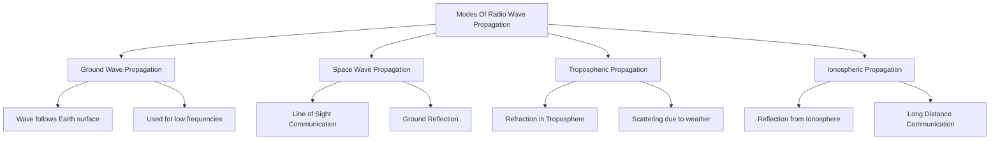

---
cssclasses:
  - wide-page
tags:
  - ect402
  - propagation
  - radio-waves
  - module-5
  - s8
  - main
course: ECT402
module: "5"
topic: Radio Wave Propagation
type: lecture-notes
semester: S8
date: 2026-04-17
related:
  - "[[Ground wave propagation]]"
  - "[[Plane earch reflection]]"
  - "[[Space wave and surface wave]]"
  - "[[Ionospheric propagation]]"
  - "[[Effects of Earth's Magnetic Field]]"
  - "[[Critical Frequency]]"
  - "[[Ionosphere Layers]]"
  - "[[Maximum Usable Frequency]]"
  - "[[Virtual Height]]"
---

# Module 5 Radio Wave Propagation

```tasks
not done
path includes {{query.file.path}}
LIMIT 10
```


## Module 5 Syllabus

- [x] [[Ground wave propagation|Ground wave propagation]] ✅ 2026-04-17
- [x] [[Plane earch reflection|Plane earth reflection]], ✅ 2026-04-17
- [x] [[Space wave and surface wave]], ✅ 2026-04-17
- [x] [[Spherical Earth Propagation]], ✅ 2026-04-17
- [x] Tropospheric waves, ✅ 2026-04-17
- [x] [[Ionospheric propagation|Ionospheric propagation]], ✅ 2026-04-17
- [x] [[Effects of Earth's Magnetic Field|Effects of earth's magnetic field]], ✅ 2026-04-17
- [x] [[Critical Frequency|Critical frequency]], ✅ 2026-04-17
- [x] [[Ionosphere Layers|Ionosphere layers]], ✅ 2026-04-17
- [x] [[Maximum Usable Frequency|Maximum usable Frequency]], ✅ 2026-04-17
- [x] [[Virtual Height|Virtual height]], ✅ 2026-04-17


```dataview 
TABLE
Frequency_Range as "Frequency Range" , Depends,Applications , Characteristic ,Advantages, Limitations
FROM #propagation and  !#magnetic-field and !#main
SORT f_start ASC
```


Radio waves are easy to generate and are widely used for 
both indoor and outdoor communications because of their 
ability to pass through buildings and travel long distances

---


## QA
### 1. What do you mean by the radio waves? Also write its features.

**Radio waves** are electromagnetic waves that are easy to generate and are widely utilized for both indoor and outdoor communications. 
- They are highly effective for these purposes because of their ability to **travel over long distances and pass through solid structures like buildings**. 
- Their propagation involves traveling from one point to another to transmit signals, finding applications in radio communication, radar, direction finding, and remote machine controlling. 
- Depending on their specific frequency, radio waves can propagate in different ways, such as following the Earth's curvature as ground waves or reflecting off the ionosphere as sky waves.


- **Omnidirectional transmission:** Because radio transmission is inherently omnidirectional, **there is no need to physically align the transmitting and receiving antennas to establish a connection**.
- **Frequency-dependent characteristics:** The specific frequency of the radio wave dictates many of its transmission behaviors and capabilities.
- **Obstacle penetration at low frequencies:** At lower frequencies, radio waves can easily pass through obstacles. However, their power attenuates following an inverse squared relationship with the distance traveled.
- **Reflection and absorption at high frequencies:** Higher frequency radio waves are more likely to be reflected by obstacles and are highly prone to being absorbed by atmospheric elements like raindrops.
- **Susceptibility to interference:** Because radio waves can travel such vast distances, interference between different transmissions is a significant problem that must be actively addressed in wireless system design.


## Modes Of Propagation Of Radio Waves
![[Module 5.png|3555]]




1. **Ground Wave (or Surface Wave) Propagation:** This is the one we just discussed, where the wave hugs the curvature of the Earth.
2. **Space Wave Propagation:** This involves waves traveling directly from the transmitting antenna to the receiving antenna (**Line of Sight**). This can also include waves that bounce once off the ground before reaching the receiver (Plane earth reflection).
3. **Tropospheric Propagation:** Waves get bent or scattered by the lower, weather-producing layer of our atmosphere (the troposphere).
4. **Ionospheric Propagation (often called Sky Wave):** These waves travel high up into the Earth's upper atmosphere (the ionosphere) and are reflected back down to Earth, allowing for very long-distance communication.

- [[Ground wave propagation]]
- [[Plane earch reflection]]
- [[Ionospheric propagation]]