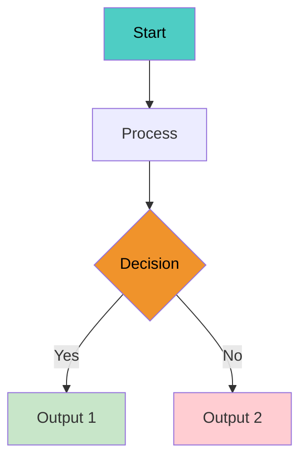
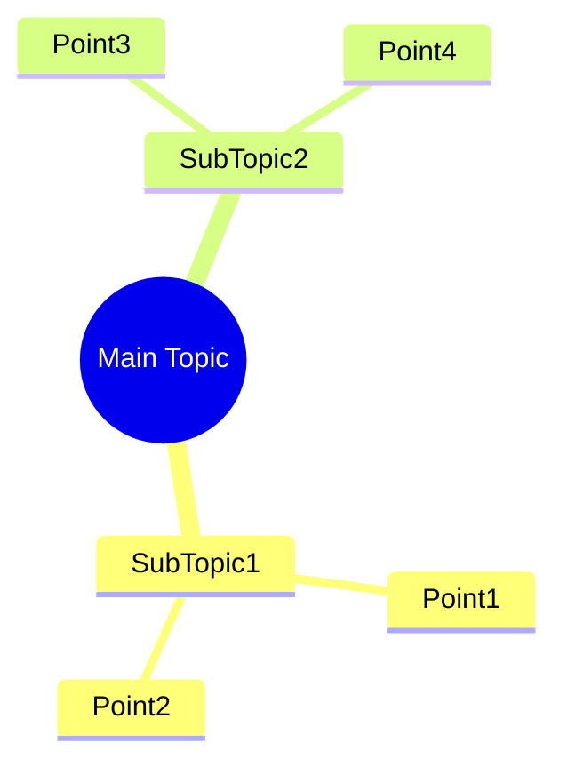
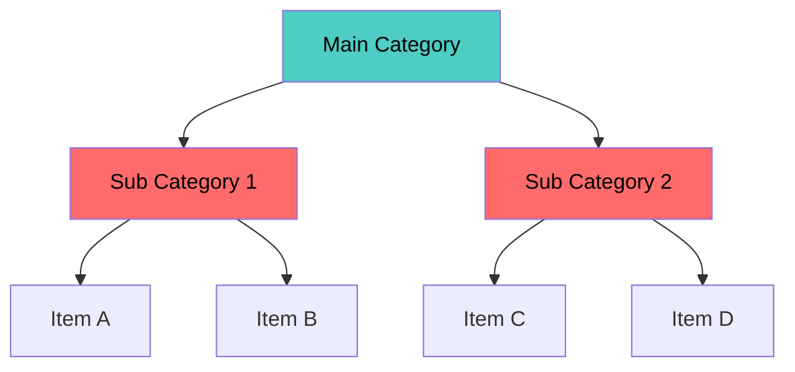
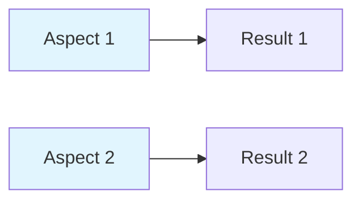

# Mermaid Diagram Templates

## Standard Colors

| Element | Color Code | Use For |
|---------|------------|---------|
| Primary | `#4ecdc4` | Main concepts |
| Secondary | `#ff6b6b` | Important/Warning |
| Highlight | `#f0932b` | Key points |
| Background | `#f7f7f7` | Boxes |

## Flowchart Template



## Mindmap Template



## Classification Diagram



## Comparison Table



## Gantt Chart Template

```mermaid
gantt
    title Activity Timeline
    dateFormat HH:mm
    axisFormat %H:%M

    section Phase 1
    Task A :a1, 00:00, 30m
    Task B :a2, after a1, 45m

    section Phase 2
    Task C :c1, after a2, 30m
```



---

## Quick Copy-Paste Examples

### For Important Formulas
```markdown
$$Formula$$ 
```

### For Callouts
```markdown
> [!tip] **Title**
> Content

> [!callout] **Warning**
> Content
```

### For Tables
```markdown
| Header 1 | Header 2 |
|----------|------------|
| Value 1 | Value 2    |
```

### For Links
```markdown
[[Module X/Topic Name|Display Text]]
```